```python
!pip3 install torch_geometric
```

    Collecting torch_geometric
      Downloading torch_geometric-2.6.1-py3-none-any.whl.metadata (63 kB)
    [?25l     ━━━━━━━━━━━━━━━━━━━━━━━━━━━━━━━━━━━━━━━━ 0.0/63.1 kB ? eta -:--:--
     ━━━━━━━━━━━━━━━━━━━━━━━━━━━━━━━━━━━━━━━━ 63.1/63.1 kB 1.7 MB/s eta 0:00:00
    [?25hRequirement already satisfied: aiohttp in /usr/local/lib/python3.11/dist-packages (from torch_geometric) (3.11.14)
    Requirement already satisfied: fsspec in /usr/local/lib/python3.11/dist-packages (from torch_geometric) (2025.3.0)
    Requirement already satisfied: jinja2 in /usr/local/lib/python3.11/dist-packages (from torch_geometric) (3.1.6)
    Requirement already satisfied: numpy in /usr/local/lib/python3.11/dist-packages (from torch_geometric) (2.0.2)
    Requirement already satisfied: psutil>=5.8.0 in /usr/local/lib/python3.11/dist-packages (from torch_geometric) (5.9.5)
    Requirement already satisfied: pyparsing in /usr/local/lib/python3.11/dist-packages (from torch_geometric) (3.2.1)
    Requirement already satisfied: requests in /usr/local/lib/python3.11/dist-packages (from torch_geometric) (2.32.3)
    Requirement already satisfied: tqdm in /usr/local/lib/python3.11/dist-packages (from torch_geometric) (4.67.1)
    Requirement already satisfied: aiohappyeyeballs>=2.3.0 in /usr/local/lib/python3.11/dist-packages (from aiohttp->torch_geometric) (2.6.1)
    Requirement already satisfied: aiosignal>=1.1.2 in /usr/local/lib/python3.11/dist-packages (from aiohttp->torch_geometric) (1.3.2)
    Requirement already satisfied: attrs>=17.3.0 in /usr/local/lib/python3.11/dist-packages (from aiohttp->torch_geometric) (25.3.0)
    Requirement already satisfied: frozenlist>=1.1.1 in /usr/local/lib/python3.11/dist-packages (from aiohttp->torch_geometric) (1.5.0)
    Requirement already satisfied: multidict<7.0,>=4.5 in /usr/local/lib/python3.11/dist-packages (from aiohttp->torch_geometric) (6.2.0)
    Requirement already satisfied: propcache>=0.2.0 in /usr/local/lib/python3.11/dist-packages (from aiohttp->torch_geometric) (0.3.0)
    Requirement already satisfied: yarl<2.0,>=1.17.0 in /usr/local/lib/python3.11/dist-packages (from aiohttp->torch_geometric) (1.18.3)
    Requirement already satisfied: MarkupSafe>=2.0 in /usr/local/lib/python3.11/dist-packages (from jinja2->torch_geometric) (3.0.2)
    Requirement already satisfied: charset-normalizer<4,>=2 in /usr/local/lib/python3.11/dist-packages (from requests->torch_geometric) (3.4.1)
    Requirement already satisfied: idna<4,>=2.5 in /usr/local/lib/python3.11/dist-packages (from requests->torch_geometric) (3.10)
    Requirement already satisfied: urllib3<3,>=1.21.1 in /usr/local/lib/python3.11/dist-packages (from requests->torch_geometric) (2.3.0)
    Requirement already satisfied: certifi>=2017.4.17 in /usr/local/lib/python3.11/dist-packages (from requests->torch_geometric) (2025.1.31)
    Downloading torch_geometric-2.6.1-py3-none-any.whl (1.1 MB)
       ━━━━━━━━━━━━━━━━━━━━━━━━━━━━━━━━━━━━━━━━ 1.1/1.1 MB 18.3 MB/s eta 0:00:00
    [?25hInstalling collected packages: torch_geometric
    Successfully installed torch_geometric-2.6.1


```python
import warnings
from datetime import datetime, timedelta
import numpy as np
import pandas as pd
import matplotlib.pyplot as plt
import matplotlib.patches as patches
import seaborn as sns
import networkx as nx
import torch
import torch.nn as nn
import torch.nn.functional as F
import torch_geometric
from torch_geometric.data import Data, DataLoader
from torch_geometric.nn import RGATConv
from sklearn.preprocessing import StandardScaler
from sklearn.model_selection import train_test_split
from sklearn.metrics import mean_squared_error, mean_absolute_error
from google.colab import drive

warnings.filterwarnings("ignore")

pd.set_option("display.expand_frame_repr", False)
pd.set_option("display.max_columns", None)
pd.set_option("display.min_rows", 100)
pd.set_option("display.max_rows", 100)
pd.set_option("display.width", None)

sns.set_theme(style="whitegrid")

drive_path = "/content/drive"
drive.mount(drive_path)
base_path = f"{drive_path}/My Drive/Colab Notebooks/gnn/input"
data_path = f"{base_path}/march-machine-learning-mania-2025"
gnn_path = f"{base_path}/gnn"

device = "cuda" if torch.cuda.is_available() else "cpu"
```

    Drive already mounted at /content/drive; to attempt to forcibly remount, call drive.mount("/content/drive", force_remount=True).


```python
def load_nodes(asc_or_des):
  nodes = pd.read_csv(f"{gnn_path}/nodes_{asc_or_des}.csv")
  nodes["Date"] = pd.to_datetime(nodes["Date"])

  nodes = pd.concat([
      nodes[["Index"]].astype("int32"),
      nodes[["Key"]],
      nodes[["Season"]].astype("int32"),
      nodes[["Date"]],
      nodes[["Le_TeamID", "Ri_TeamID"]].astype("int32"),
      nodes[["Le_TeamName", "Ri_TeamName"]],
      nodes.loc[:, "Le_Margin":].astype("int32"),
    ],
    axis=1,
  )

  nodes.index = nodes.index.astype("int32")

  return nodes
```


```python
nodes_asc = load_nodes("asc")

print(f"nodes_asc {nodes_asc.shape}")
print(nodes_asc)
print()
nodes_asc.info()
```

    nodes_asc (202866, 43)
             Index                 Key  Season       Date  Le_TeamID  Ri_TeamID      Le_TeamName      Ri_TeamName  Le_Margin  SeasonsAgo  Men  NCAATourney  DayNum  NumOT  Le_Loc  Le_Score  Le_FGM  Le_FGA  Le_FGM3  Le_FGA3  Le_FTM  Le_FTA  Le_OR  Le_DR  Le_Ast  Le_TO  Le_Stl  Le_Blk  Le_PF  Ri_Score  Ri_FGM  Ri_FGA  Ri_FGM3  Ri_FGA3  Ri_FTM  Ri_FTA  Ri_OR  Ri_DR  Ri_Ast  Ri_TO  Ri_Stl  Ri_Blk  Ri_PF
    0            0  2003_010_1104_1328    2003 2002-11-14       1104       1328          Alabama         Oklahoma          6          22    1            0      10      0       0        68      27      58        3       14      11      18     14     24      13     23       7       1     22        62      22      53        2       10      16      22     10     22       8     18       9       2     20
    1            1  2003_010_1272_1393    2003 2002-11-14       1272       1393          Memphis         Syracuse          7          22    1            0      10      0       0        70      26      62        8       20      10      19     15     28      16     13       4       4     18        63      24      67        6       24       9      20     20     25       7     12       8       6     16
    2            2  2003_011_1186_1458    2003 2002-11-15       1186       1458     E Washington        Wisconsin        -26          22    1            0      11      0      -1        55      20      46        3       11      12      17      6     22       8     19       4       3     25        81      26      57        6       12      23      27     12     24      12      9       9       3     18
    3            3  2003_011_1208_1400    2003 2002-11-15       1208       1400          Georgia            Texas         -6          22    1            0      11      0       0        71      24      62        6       16      17      27     21     15      12     10       7       1     14        77      30      61        6       14      11      13     17     22      12     14       4       4     20
    4            4  2003_011_1266_1437    2003 2002-11-15       1266       1437        Marquette        Villanova         12          22    1            0      11      0       0        73      24      58        8       18      17      29     17     26      15     10       5       2     25        61      22      73        3       26      14      23     31     22       9     12       2       5     23
    5            5  2003_011_1296_1457    2003 2002-11-15       1296       1457       N Illinois         Winthrop          6          22    1            0      11      0       0        56      18      38        3        9      17      31      6     19      11     12      14       2     18        50      18      49        6       22       8      15     17     20       9     19       4       3     23
    6            6  2003_012_1156_1194    2003 2002-11-16       1156       1194     Cleveland St      FL Atlantic         -5          22    1            0      12      0       0        66      24      52        6       18      12      27     13     26      13     25       8       2     18        71      28      58        5       11      10      18      9     22       9     17       9       2     23
    7            7  2003_012_1161_1236    2003 2002-11-16       1161       1236      Colorado St              PFW         18          22    1            0      12      0       1        80      23      55        2        8      32      39     13     18      14     17      11       1     25        62      19      41        4       15      20      28      9     21      11     30      10       4     28
    8            8  2003_012_1186_1457    2003 2002-11-16       1186       1457     E Washington         Winthrop         14          22    1            0      12      0       0        75      28      62        4       14      15      21     13     35      19     19       7       2     21        61      20      59        4       17      17      23      8     25      10     15      14       8     18
    9            9  2003_012_1296_1458    2003 2002-11-16       1296       1458       N Illinois        Wisconsin        -28          22    1            0      12      0      -1        56      23      52        3       14       7      12      9     23      10     18       1       3     18        84      32      67        5       17      15      19     14     22      11      6      12       0     13
    10          10  2003_013_1106_1202    2003 2002-11-17       1106       1202       Alabama St           Furman         -1          22    1            0      13      0       0        73      29      63       10       22       5       5     13     16      15     12       6       2     12        74      29      51        7       13       9      11      6     21      18     15       7       1      5
    11          11  2003_013_1125_1323    2003 2002-11-17       1125       1323          Belmont       Notre Dame        -28          22    1            0      13      0      -1        48      18      64        8       24       4       8     14     26      12     17      10       0     17        76      25      56       10       23      16      23      8     35      18     13      14      19     13
    12          12  2003_013_1135_1237    2003 2002-11-17       1135       1237            Brown            IUPUI         -1          22    1            0      13      0       0        65      24      56        6       19      11      17     14     21      17     18       8       4     13        66      26      66        5       19       9      13     21     23      15     17      12       3     17
    13          13  2003_013_1166_1426    2003 2002-11-17       1166       1426        Creighton     UT Arlington         56          22    1            0      13      0       1       106      41      69       15       25       9      13     15     29      21     11      10       6     16        50      17      52        4       11      12      17      8     15       8     17       7       3     15
    14          14  2003_014_1106_1426    2003 2002-11-18       1106       1426       Alabama St     UT Arlington        -12          22    1            0      14      0       0        47      20      60        6       18       1       2      8     15      10      8      10       6     14        59      25      53        1        5       8      12     15     32      14     16       6       4      7
    15          15  2003_014_1125_1135    2003 2002-11-18       1125       1135          Belmont            Brown          6          22    1            0      14      1       0        83      30      70       11       31      12      15     15     18      22     16      18       5     21        77      28      60        4       15      17      27     20     27      17     24       7       7     19
    16          16  2003_014_1129_1183    2003 2002-11-18       1129       1183         Boise St       E Illinois        -14          22    1            0      14      0       1        59      21      51        3       14      14      18     12     22      10     23       4       5     14        73      29      59        9       19       6       8      8     21      17     15      10       1     19
    17          17  2003_014_1131_1390    2003 2002-11-18       1131       1390      Boston Univ         Stanford         -4          22    1            0      14      0      -1        57      19      54        3       17      16      18     11     22       7     14       7       0     24        61      20      53        6       27      15      24     15     24       9     14       4       2     17
    18          18  2003_014_1156_1236    2003 2002-11-18       1156       1236     Cleveland St              PFW          7          22    1            0      14      0       0        78      27      46       10       18      14      24      8     25      18     15       2       6     18        71      23      50        7       20      18      24      6     17      21     11       5       1     21
    19          19  2003_014_1161_1194    2003 2002-11-18       1161       1194      Colorado St      FL Atlantic         25          22    1            0      14      0       1        81      22      48        5       12      32      43     16     32      13     24       5       3     19        56      21      65        2       13      12      19     16     18      10     16      15       3     36
    20          20  2003_014_1162_1353    2003 2002-11-18       1162       1353         Columbia          Rutgers        -24          22    1            0      14      0      -1        36      12      39        3        8       9      13     11     23       4     27       2       4     19        60      23      57        4       19      10      15     15     18      10     12      14       6     18
    21          21  2003_014_1166_1202    2003 2002-11-18       1166       1202        Creighton           Furman         25          22    1            0      14      0       1        82      33      61        8       19       8      14      9     23      21     17      14       5     18        57      23      55        2       11       9      14     13     23       9     26       8       4     18
    22          22  2003_014_1237_1323    2003 2002-11-18       1237       1323            IUPUI       Notre Dame        -44          22    1            0      14      0      -1        45      18      74        4       15       5      11     27     22      10     17       6       3     23        89      34      62        8       16      13      21     12     34      25     11       9      13     16
    23          23  2003_014_1314_1336    2003 2002-11-18       1314       1336   North Carolina          Penn St         30          22    1            0      14      0       1        85      32      60        5       15      16      23     12     34      18     14       8       4     12        55      21      71        3       23      10      11     15     20       6     13       7       5     19
    24          24  2003_014_1389_1462    2003 2002-11-18       1389       1462       St Peter's           Xavier        -39          22    1            0      14      0      -1        48      20      63        7       20       1       4     16     18      11     19       4       3     16        87      35      70        6       19      11      16     17     27      18      7      13       3     10
    25          25  2003_015_1156_1161    2003 2002-11-19       1156       1161     Cleveland St      Colorado St        -14          22    1            0      15      0      -1        63      23      51        3       13      14      20      7     19      13     13       6       6     22        77      27      58        5       10      18      27     18     26      15     12       5       4     21
    26          26  2003_015_1194_1236    2003 2002-11-19       1194       1236      FL Atlantic              PFW          7          22    1            0      15      2       0        93      33      75        9       20      18      33     17     26      14     14      17       0     21        86      27      58       14       31      18      22      9     33      20     26       6       7     25
    27          27  2003_015_1196_1256    2003 2002-11-19       1196       1256          Florida   Louisiana Tech         21          22    1            0      15      0       1        76      28      48        4       13      16      24      8     23      18     18      13       5     19        55      19      49        1        5      16      22     12     17      14     22       8       2     22
    28          28  2003_015_1221_1242    2003 2002-11-19       1221       1242       Holy Cross           Kansas        -24          22    1            0      15      0      -1        57      18      52        7       21      14      21      8     22      11     20       9       3     27        81      28      53        3        5      22      37     13     29      12     19      10       3     21
    29          29  2003_015_1422_1447    2003 2002-11-19       1422       1447   UNC Greensboro           Wagner         19          22    1            0      15      0       1        84      33      53        3        8      15      20      7     36      12     22       5       9     19        65      26      70        3       25      10      16     14     15       9     12      10       2     16
    30          30  2003_016_1314_1353    2003 2002-11-20       1314       1353   North Carolina          Rutgers          4          22    1            0      16      0       1        71      27      57        5       14      12      19     14     30      19     20       8       5     13        67      27      66        9       22       4      11     12     19      10     15      11       4     20
    31          31  2003_016_1390_1462    2003 2002-11-20       1390       1462         Stanford           Xavier          1          22    1            0      16      0       1        63      23      57        6       15      11      21     17     20      12     10       8       1     19        62      18      45        6       20      20      28     11     17       6     14       5       1     19
    32          32  2003_017_1147_1304    2003 2002-11-21       1147       1304        Centenary         Nebraska        -23          22    1            0      17      0       0        45      10      50        2       16      23      31     16     24       3     20       6       3     19        68      27      58        6       18       8      13     10     28      13     17       5       5     26
    33          33  2003_017_1183_1196    2003 2002-11-21       1183       1196       E Illinois          Florida        -34          22    1            0      17      0      -1        65      22      66        4       11      17      24     15     23      15     17       9       3     19        99      39      73       11       28      10      22     16     31      32     14      10      14     19
    34          34  2003_018_1104_1106    2003 2002-11-22       1104       1106          Alabama       Alabama St         26          22    1            0      18      0       1        82      24      49       10       20      24      34     12     26      13     13       7       3     14        56      19      55        8       21      10      12     11     18       8     15       6       2     22
    35          35  2003_018_1107_1373    2003 2002-11-22       1107       1373      SUNY Albany            Siena         -4          22    1            0      18      0      -1        75      26      59       13       27      10      16      8     21      19     14       7       0     19        79      29      64        5       21      16      20     15     29      17     14       5       3     16
    36          36  2003_018_1108_1379    2003 2002-11-22       1108       1379        Alcorn St    Southern Miss         -8          22    1            0      18      0      -1        70      26      54        5       11      13      23     10     27       7     21       4       4     23        78      26      59        0        8      26      32      7     23      17      8       8       2     20
    37          37  2003_018_1110_1281    2003 2002-11-22       1110       1281    American Univ         Missouri        -15          22    1            0      18      0      -1        57      22      63        8       30       5       8     14     20      16     18       7       1     18        72      28      62        5       18      11      15     16     29      11     16      12       4     13
    38          38  2003_018_1113_1287    2003 2002-11-22       1113       1287       Arizona St      Morehead St          3          22    1            0      18      0       1        59      22      54        1       12      14      25     13     27      12     15       6       5     15        56      22      63        7       24       5       9     16     23      13     18       6       4     25
    39          39  2003_018_1114_1218    2003 2002-11-22       1114       1218  Ark Little Rock           Hawaii        -16          22    1            0      18      0      -1        65      23      56        3       15      16      21      9     27       8     17       6       0     26        81      29      59        8       18      15      28     10     23      21     11       6       4     21
    40          40  2003_018_1116_1238    2003 2002-11-22       1116       1238         Arkansas       Jackson St         37          22    1            0      18      0       1        81      25      65        4       18      27      48     29     48      12     27      11       8     29        44      13      62        2       16      16      32      8     21       4     19       8       4     31
    41          41  2003_018_1117_1369    2003 2002-11-22       1117       1369      Arkansas St   SE Missouri St         12          22    1            0      18      0       1        83      30      72        7       19      16      20     24     17      12     12       8       3     14        71      27      52        5       15      12      16     11     20      10     18       2       4     17
    42          42  2003_018_1120_1459    2003 2002-11-22       1120       1459           Auburn          Wofford         18          22    1            0      18      0       1        81      32      54        3       11      14      23      9     27      14     19      13       9     15        63      21      59       10       24      11      13     13     18      13     22       9       0     18
    43          43  2003_018_1122_1272    2003 2002-11-22       1122       1272      Austin Peay          Memphis          1          22    1            0      18      1      -1        81      29      70       11       24      12      17     13     27      19     13       6       5     27        80      24      62        8       19      24      34     13     31      17     14       4       7     17
    44          44  2003_018_1123_1240    2003 2002-11-22       1123       1240          Ball St  Jacksonville St          8          22    1            0      18      0       0        72      24      52        7       19      17      22     11     21      11     14       2       3     16        64      23      49        3       14      15      21      9     20      12     17       6       2     23
    45          45  2003_018_1128_1412    2003 2002-11-22       1128       1412    Birmingham So              UAB        -18          22    1            0      18      0      -1        53      16      46        6       24      15      27     16     26       8     36      11       5     18        71      26      65        3       14      16      24     16     21      18     19      17       2     22
    46          46  2003_018_1133_1337    2003 2002-11-22       1133       1337          Bradley       Pepperdine         14          22    1            0      18      1       1        95      34      79        5       24      22      34     19     40      17     15       7       1     21        81      29      71        9       29      14      22      8     35      15     15       6       3     30
    47          47  2003_018_1137_1323    2003 2002-11-22       1137       1323         Bucknell       Notre Dame        -31          22    1            0      18      0      -1        42      12      57        3       18      15      24     12     25       5     20       9       4     18        73      28      59        5       14      12      16      9     38      13     19      11       7     21
    48          48  2003_018_1138_1165    2003 2002-11-22       1138       1165          Buffalo          Cornell         -6          22    1            0      18      0       1        72      25      67        7       31      15      22     18     14      13     10       9       3     22        78      30      50        5       11      13      23     10     28      20     16       5       0     19
    49          49  2003_018_1139_1236    2003 2002-11-22       1139       1236           Butler              PFW         16          22    1            0      18      0      -1        69      27      53       10       24       5       9      4     22      22     12       7       0     18        53      20      44        6       18       7      15      4     23      13     10       9       1     14
    ...        ...                 ...     ...        ...        ...        ...              ...              ...        ...         ...  ...          ...     ...    ...     ...       ...     ...     ...      ...      ...     ...     ...    ...    ...     ...    ...     ...     ...    ...       ...     ...     ...      ...      ...     ...     ...    ...    ...     ...    ...     ...     ...    ...
    202816  202816  2025_130_3251_3256    2025 2025-03-14       3251       3256          Liberty   Louisiana Tech         27           0    0            0     130      0       0        80      29      57        8       20      14      17      6     21      19      9       6       2     15        53      17      45        7       18      12      16      4     16      10     14       5       2     21
    202817  202817  2025_130_3292_3443    2025 2025-03-14       3292       3443             MTSU              WKU          8           0    0            0     130      0       0        71      23      45        9       17      16      19      4     26      11     13       4       3     17        63      19      54       12       30      13      16      9     16      13     11       7       0     18
    202818  202818  2025_130_3299_3456    2025 2025-03-14       3299       3456           NC A&T   William & Mary         -8           0    0            0     130      1       0        66      27      73        5       22       7       9     12     20      15      8      13       1     11        74      30      58       11       19       3       3      6     31      18     20       4       3     17
    202819  202819  2025_130_3346_3467    2025 2025-03-14       3346       3467       Quinnipiac        Merrimack         14           0    0            0     130      0       0        65      24      60        3       13      14      20     12     16      10      9      11       2     15        51      19      54        3       17      10      12      9     20      12     16       3       2     18
    202820  202820  2025_130_3413_3414    2025 2025-03-14       3413       3414         UC Davis        UC Irvine          7           0    0            0     130      0       0        63      19      45        8       18      17      22      6     29      14     19       8       2     15        56      21      61        5       22       9      14      8     18      14      9      10       2     16
    202821  202821  2025_130_3426_3470    2025 2025-03-14       3426       3470     UT Arlington      Tarleton St         11           0    0            0     130      0       0        66      22      53        1        5      21      25      6     20       6     13      11       4     24        55      17      57        4       15      17      24     18     23       7     19       4       8     22
    202822  202822  2025_131_1103_1275    2025 2025-03-15       1103       1275            Akron         Miami OH          2           0    1            0     131      0       0        76      27      59        9       27      13      16     11     19      14      9       8       3      9        74      28      57       15       30       3       5      6     17      13     10       6       2     14
    202823  202823  2025_131_1104_1196    2025 2025-03-15       1104       1196          Alabama          Florida        -22           0    1            0     131      0       0        82      28      67       11       35      15      23     10     26      14     10       4       4     16       104      37      72       12       27      18      28     13     27      17      7       8       4     19
    202824  202824  2025_131_1106_1238    2025 2025-03-15       1106       1238       Alabama St       Jackson St          4           0    1            0     131      0       0        60      22      65        9       29       7      11     10     21      13      6      10       4     16        56      20      54        5       17      11      15     10     29      12     14       3       5     13
    202825  202825  2025_131_1112_1222    2025 2025-03-15       1112       1222          Arizona          Houston         -8           0    1            0     131      0       0        64      25      57        5       18       9      12      7     27       6     11       4       3     15        72      26      61        9       23      11      12      9     22       7      8       4       3     15
    202826  202826  2025_131_1120_1397    2025 2025-03-15       1120       1397           Auburn        Tennessee         -5           0    1            0     131      0       0        65      23      55        6       21      13      22      8     16      13      6       6       3     21        70      20      47        5       19      25      27     10     22       7     10       5       2     18
    202827  202827  2025_131_1129_1161    2025 2025-03-15       1129       1161         Boise St      Colorado St        -13           0    1            0     131      0       0        56      19      49        8       27      10      14      7     20      13     13       4       2     16        69      22      51       12       24      13      19      5     21      14      8       2       0     15
    202828  202828  2025_131_1136_1263    2025 2025-03-15       1136       1263           Bryant            Maine         18           0    1            0     131      0       1        77      31      62        5       17      10      12     11     32      12     18      10       5     19        59      22      57        1        7      14      20      5     18       9     12      12       3     11
    202829  202829  2025_131_1165_1171    2025 2025-03-15       1165       1171          Cornell        Dartmouth         16           0    1            0     131      0       0        87      32      60       10       29      13      18      6     30      18      9       7       6     14        71      26      66        7       29      12      17      6     22       8      8       6       1     15
    202830  202830  2025_131_1166_1385    2025 2025-03-15       1166       1385        Creighton        St John's        -16           0    1            0     131      0       0        66      26      60        6       26       8      16     11     22      16     13       5       3     12        82      34      65        7       14       7      11     10     25      16      9       5       6     16
    202831  202831  2025_131_1181_1257    2025 2025-03-15       1181       1257             Duke       Louisville         11           0    1            0     131      0       0        73      22      50       10       27      19      24      8     23      11      9       6       5     13        62      25      64        7       26       5      10     11     19      11     11       3       2     19
    202832  202832  2025_131_1206_1386    2025 2025-03-15       1206       1386     George Mason   St Joseph's PA         10           0    1            0     131      0       0        74      26      51        9       17      13      15      7     24      20     15       7       6     14        64      22      66        8       36      12      16     16     19       8     12      11       0     16
    202833  202833  2025_131_1213_1430    2025 2025-03-15       1213       1430     Grand Canyon      Utah Valley          7           0    1            0     131      0      -1        89      28      54        6       17      27      33      6     20      10      8       7       7     22        82      27      58        9       19      19      28     11     18      13     11       3       1     25
    202834  202834  2025_131_1233_1291    2025 2025-03-15       1233       1291             Iona     Mt St Mary's        -14           0    1            0     131      0       0        49      18      58        5       23       8      13     14     19       9     15       7       1     18        63      22      52       12       32       7      11      5     23      18     15       6       3     17
    202835  202835  2025_131_1240_1251    2025 2025-03-15       1240       1251  Jacksonville St          Liberty        -12           0    1            0     131      0       0        67      24      55        6       18      13      25      9     18      11      5       6       4     13        79      30      50       12       20       7       9      1     23      18      8       3       3     18
    202836  202836  2025_131_1260_1433    2025 2025-03-15       1260       1433   Loyola-Chicago              VCU         -7           0    1            0     131      0       0        55      20      68        5       25      10      16     18     23      10     10       7       4     18        62      22      51        6       24      12      21      8     28      11     10       6       6     16
    202837  202837  2025_131_1268_1276    2025 2025-03-15       1268       1276         Maryland         Michigan         -1           0    1            0     131      0       0        80      27      61        7       21      19      23      3     13      17      6       7       6     12        81      31      66        7       18      12      13     14     24      17     16       3       2     20
    202838  202838  2025_131_1272_1408    2025 2025-03-15       1272       1408          Memphis           Tulane          1           0    1            0     131      0       0        78      25      65        5       23      23      38     20     24      16     13       9       5     17        77      27      60        9       29      14      21      5     25      16     12       9       4     27
    202839  202839  2025_131_1277_1458    2025 2025-03-15       1277       1458      Michigan St        Wisconsin         -3           0    1            0     131      0       0        74      24      59        7       19      19      24      8     28      13      7       1       2     20        77      23      54        9       29      22      28      5     27      15      7       3       4     21
    202840  202840  2025_131_1313_1354    2025 2025-03-15       1313       1354       Norfolk St    S Carolina St          1           0    1            0     131      0       0        66      20      48        3        9      23      34     10     20      13     15       8       5     11        65      23      62       10       27       9      12     13     18      16     15       9       6     22
    202841  202841  2025_131_1317_1412    2025 2025-03-15       1317       1412      North Texas              UAB        -10           0    1            0     131      0       0        56      20      62        4       18      12      16     17     20       9      9       6       2     14        66      24      56        4       16      14      19     13     21      13      8       4       5     14
    202842  202842  2025_131_1343_1463    2025 2025-03-15       1343       1463        Princeton             Yale         -2           0    1            0     131      0       0        57      22      57       10       35       3       3      5     20      14      7       5       2     17        59      22      49        3       15      12      18      7     26       7      8       3       3      9
    202843  202843  2025_131_1414_1471    2025 2025-03-15       1414       1471        UC Irvine     UC San Diego        -14           0    1            0     131      0       0        61      20      57        8       29      13      13      4     21      14     12       9       4     12        75      27      55       12       29       9      13      5     27      22     12       8       3     13
    202844  202844  2025_131_3108_3380    2025 2025-03-15       3108       3380        Alcorn St    Southern Univ        -20           0    0            0     131      0       0        44      16      45        4       18       8      11      5     23      11     17       3       4     17        64      21      54        6       19      16      17      9     24      13      9       9       3     13
    202845  202845  2025_131_3123_3405    2025 2025-03-15       3123       3405          Ball St           Toledo          7           0    0            0     131      0       0        65      26      58        3       12      10      11      8     21      11     15       6       3     13        58      24      56        7       19       3       5      4     17      10     16       9       3     19
    202846  202846  2025_131_3125_3283    2025 2025-03-15       3125       3283          Belmont      Missouri St          9           0    0            0     131      0       0        76      24      58        8       27      20      23      6     30      10     10       5       3     21        67      22      59        5       16      18      26      5     26       5     12       6       3     19
    202847  202847  2025_131_3144_3158    2025 2025-03-15       3144       3158         Campbell   Col Charleston         21           0    0            0     131      0       0        80      24      64       14       28      18      28     18     33      19     15       4       5     16        59      18      68        5       21      18      20     16     18       7      9       8       4     22
    202848  202848  2025_131_3146_3195    2025 2025-03-15       3146       3195    Cent Arkansas             FGCU        -17           0    0            0     131      0      -1        51      16      51        6       20      13      17      7     23       4     21      10       1     14        68      26      61        6       24      10      12      9     22      11     15      14       1     12
    202849  202849  2025_131_3162_3217    2025 2025-03-15       3162       3217         Columbia          Harvard         -3           0    0            0     131      0       0        71      23      60       10       26      15      20     15     16      13     11       7       1     10        74      30      61        7       21       7       8     10     16      18      8       7       4     12
    202850  202850  2025_131_3179_3293    2025 2025-03-15       3179       3293            Drake        Murray St         -6           0    0            0     131      0       0        90      35      74        7       30      13      14     11     24      13     15       6       4     27        96      29      59        9       25      29      33      4     23      15     12       7       1     18
    202851  202851  2025_131_3180_3456    2025 2025-03-15       3180       3456           Drexel   William & Mary        -22           0    0            0     131      0       0        54      20      65        5       29       9      12     11     18      13     15      10       3     17        76      28      56       12       22       8      12      8     30      19     17       9       6     15
    202852  202852  2025_131_3193_3346    2025 2025-03-15       3193       3346        Fairfield       Quinnipiac         23           0    0            0     131      0       0        76      28      57       15       29       5       5      6     21      18      9       6       2     10        53      21      51        6       19       5       5      3     20      11     14       4       2     13
    202853  202853  2025_131_3213_3426    2025 2025-03-15       3213       3426     Grand Canyon     UT Arlington          3           0    0            0     131      0       0        65      23      59        4       16      15      20     11     16      16     23      12       4     18        62      23      51        5       11      11      15      5     22      19     27       9       4     17
    202854  202854  2025_131_3224_3313    2025 2025-03-15       3224       3313           Howard       Norfolk St        -12           0    0            0     131      0       0        56      18      57        7       25      13      14      9     23      12     19       3       6     13        68      26      65        6       18      10      15      6     22      14     11      13      13     11
    202855  202855  2025_131_3251_3292    2025 2025-03-15       3251       3292          Liberty             MTSU          5           0    0            0     131      0       0        53      17      57        9       26      10      10     11     28       9     14       4       5     13        48      18      54        5       18       7      11      3     23       9      9       6       7     13
    202856  202856  2025_131_3413_3471    2025 2025-03-15       3413       3471         UC Davis     UC San Diego         -9           0    0            0     131      0       1        66      24      67        9       29       9      14      9     26      14     10       6       5     22        75      26      62        4       19      19      28      8     31      10     11       6       1     20
    202857  202857  2025_132_1165_1463    2025 2025-03-16       1165       1463          Cornell             Yale         -6           0    1            0     132      0       0        84      29      52       11       27      15      16      4     26      15     11       2       2     16        90      31      62       13       23      15      21      7     20      15      3       5       0     17
    202858  202858  2025_132_1196_1397    2025 2025-03-16       1196       1397          Florida        Tennessee          9           0    1            0     132      0       0        86      26      61        9       27      25      28     15     24      11      8       6       1     25        77      22      49        8       26      25      32      5     20      15      9       7       5     21
    202859  202859  2025_132_1206_1433    2025 2025-03-16       1206       1433     George Mason              VCU         -5           0    1            0     132      0       0        63      19      56        9       21      16      19     14     19      13     11      11       3     22        68      19      47        8       25      22      27     11     25      10     16       7       9     20
    202860  202860  2025_132_1272_1412    2025 2025-03-16       1272       1412          Memphis              UAB         12           0    1            0     132      0       0        84      32      68        6       13      14      23     18     27      13     12      10       7     18        72      24      69        7       27      17      23     21     23      10     15       5       4     21
    202861  202861  2025_132_1276_1458    2025 2025-03-16       1276       1458         Michigan        Wisconsin          6           0    1            0     132      0       0        59      19      59        9       33      12      13      6     34      14      8       3       2     16        53      15      68        7       39      16      18     15     31       8      6       3       2     14
    202862  202862  2025_132_3119_3250    2025 2025-03-16       3119       3250             Army           Lehigh        -12           0    0            0     132      0      -1        62      25      56        6       17       6      10      8     13      10     10       5       0     20        74      27      45        5       14      15      17      5     25      15     15       6       0     12
    202863  202863  2025_132_3125_3293    2025 2025-03-16       3125       3293          Belmont        Murray St        -21           0    0            0     132      0       0        62      24      68        2       21      12      14     12     22      11      7       5       0     16        83      28      54       14       28      13      15      5     33      21     13       2       3     15
    202864  202864  2025_132_3144_3456    2025 2025-03-16       3144       3456         Campbell   William & Mary         -3           0    0            0     132      0       0        63      24      55        5       20      10      12      8     33      12     16       4       2     12        66      27      63        8       23       4       7      5     25       9      9       6       3     13
    202865  202865  2025_132_3192_3476    2025 2025-03-16       3192       3476      F Dickinson        Stonehill         17           0    0            0     132      0       1        66      23      55        3       21      17      18     10     22      11      9       8       1      8        49      21      57        4       20       3       4     14     22      14     17       4       1     17
    
    [202866 rows x 43 columns]
    
    <class 'pandas.core.frame.DataFrame'>
    Index: 202866 entries, 0 to 202865
    Data columns (total 43 columns):
     #   Column       Non-Null Count   Dtype         
    ---  ------       --------------   -----         
     0   Index        202866 non-null  int32         
     1   Key          202866 non-null  object        
     2   Season       202866 non-null  int32         
     3   Date         202866 non-null  datetime64[ns]
     4   Le_TeamID    202866 non-null  int32         
     5   Ri_TeamID    202866 non-null  int32         
     6   Le_TeamName  202866 non-null  object        
     7   Ri_TeamName  202866 non-null  object        
     8   Le_Margin    202866 non-null  int32         
     9   SeasonsAgo   202866 non-null  int32         
     10  Men          202866 non-null  int32         
     11  NCAATourney  202866 non-null  int32         
     12  DayNum       202866 non-null  int32         
     13  NumOT        202866 non-null  int32         
     14  Le_Loc       202866 non-null  int32         
     15  Le_Score     202866 non-null  int32         
     16  Le_FGM       202866 non-null  int32         
     17  Le_FGA       202866 non-null  int32         
     18  Le_FGM3      202866 non-null  int32         
     19  Le_FGA3      202866 non-null  int32         
     20  Le_FTM       202866 non-null  int32         
     21  Le_FTA       202866 non-null  int32         
     22  Le_OR        202866 non-null  int32         
     23  Le_DR        202866 non-null  int32         
     24  Le_Ast       202866 non-null  int32         
     25  Le_TO        202866 non-null  int32         
     26  Le_Stl       202866 non-null  int32         
     27  Le_Blk       202866 non-null  int32         
     28  Le_PF        202866 non-null  int32         
     29  Ri_Score     202866 non-null  int32         
     30  Ri_FGM       202866 non-null  int32         
     31  Ri_FGA       202866 non-null  int32         
     32  Ri_FGM3      202866 non-null  int32         
     33  Ri_FGA3      202866 non-null  int32         
     34  Ri_FTM       202866 non-null  int32         
     35  Ri_FTA       202866 non-null  int32         
     36  Ri_OR        202866 non-null  int32         
     37  Ri_DR        202866 non-null  int32         
     38  Ri_Ast       202866 non-null  int32         
     39  Ri_TO        202866 non-null  int32         
     40  Ri_Stl       202866 non-null  int32         
     41  Ri_Blk       202866 non-null  int32         
     42  Ri_PF        202866 non-null  int32         
    dtypes: datetime64[ns](1), int32(39), object(3)
    memory usage: 37.1+ MB


```python
nodes_des = load_nodes("des")

print(f"nodes_des {nodes_des.shape}")
print(nodes_des)
print()
nodes_des.info()
```

    nodes_des (202866, 43)
             Index                 Key  Season       Date  Le_TeamID  Ri_TeamID      Le_TeamName      Ri_TeamName  Le_Margin  SeasonsAgo  Men  NCAATourney  DayNum  NumOT  Le_Loc  Le_Score  Le_FGM  Le_FGA  Le_FGM3  Le_FGA3  Le_FTM  Le_FTA  Le_OR  Le_DR  Le_Ast  Le_TO  Le_Stl  Le_Blk  Le_PF  Ri_Score  Ri_FGM  Ri_FGA  Ri_FGM3  Ri_FGA3  Ri_FTM  Ri_FTA  Ri_OR  Ri_DR  Ri_Ast  Ri_TO  Ri_Stl  Ri_Blk  Ri_PF
    0            0  2003_010_1104_1328    2003 2002-11-14       1328       1104         Oklahoma          Alabama         -6          22    1            0      10      0       0        62      22      53        2       10      16      22     10     22       8     18       9       2     20        68      27      58        3       14      11      18     14     24      13     23       7       1     22
    1            1  2003_010_1272_1393    2003 2002-11-14       1393       1272         Syracuse          Memphis         -7          22    1            0      10      0       0        63      24      67        6       24       9      20     20     25       7     12       8       6     16        70      26      62        8       20      10      19     15     28      16     13       4       4     18
    2            2  2003_011_1186_1458    2003 2002-11-15       1458       1186        Wisconsin     E Washington         26          22    1            0      11      0       1        81      26      57        6       12      23      27     12     24      12      9       9       3     18        55      20      46        3       11      12      17      6     22       8     19       4       3     25
    3            3  2003_011_1208_1400    2003 2002-11-15       1400       1208            Texas          Georgia          6          22    1            0      11      0       0        77      30      61        6       14      11      13     17     22      12     14       4       4     20        71      24      62        6       16      17      27     21     15      12     10       7       1     14
    4            4  2003_011_1266_1437    2003 2002-11-15       1437       1266        Villanova        Marquette        -12          22    1            0      11      0       0        61      22      73        3       26      14      23     31     22       9     12       2       5     23        73      24      58        8       18      17      29     17     26      15     10       5       2     25
    5            5  2003_011_1296_1457    2003 2002-11-15       1457       1296         Winthrop       N Illinois         -6          22    1            0      11      0       0        50      18      49        6       22       8      15     17     20       9     19       4       3     23        56      18      38        3        9      17      31      6     19      11     12      14       2     18
    6            6  2003_012_1156_1194    2003 2002-11-16       1194       1156      FL Atlantic     Cleveland St          5          22    1            0      12      0       0        71      28      58        5       11      10      18      9     22       9     17       9       2     23        66      24      52        6       18      12      27     13     26      13     25       8       2     18
    7            7  2003_012_1161_1236    2003 2002-11-16       1236       1161              PFW      Colorado St        -18          22    1            0      12      0      -1        62      19      41        4       15      20      28      9     21      11     30      10       4     28        80      23      55        2        8      32      39     13     18      14     17      11       1     25
    8            8  2003_012_1186_1457    2003 2002-11-16       1457       1186         Winthrop     E Washington        -14          22    1            0      12      0       0        61      20      59        4       17      17      23      8     25      10     15      14       8     18        75      28      62        4       14      15      21     13     35      19     19       7       2     21
    9            9  2003_012_1296_1458    2003 2002-11-16       1458       1296        Wisconsin       N Illinois         28          22    1            0      12      0       1        84      32      67        5       17      15      19     14     22      11      6      12       0     13        56      23      52        3       14       7      12      9     23      10     18       1       3     18
    10          10  2003_013_1106_1202    2003 2002-11-17       1202       1106           Furman       Alabama St          1          22    1            0      13      0       0        74      29      51        7       13       9      11      6     21      18     15       7       1      5        73      29      63       10       22       5       5     13     16      15     12       6       2     12
    11          11  2003_013_1125_1323    2003 2002-11-17       1323       1125       Notre Dame          Belmont         28          22    1            0      13      0       1        76      25      56       10       23      16      23      8     35      18     13      14      19     13        48      18      64        8       24       4       8     14     26      12     17      10       0     17
    12          12  2003_013_1135_1237    2003 2002-11-17       1237       1135            IUPUI            Brown          1          22    1            0      13      0       0        66      26      66        5       19       9      13     21     23      15     17      12       3     17        65      24      56        6       19      11      17     14     21      17     18       8       4     13
    13          13  2003_013_1166_1426    2003 2002-11-17       1426       1166     UT Arlington        Creighton        -56          22    1            0      13      0      -1        50      17      52        4       11      12      17      8     15       8     17       7       3     15       106      41      69       15       25       9      13     15     29      21     11      10       6     16
    14          14  2003_014_1106_1426    2003 2002-11-18       1426       1106     UT Arlington       Alabama St         12          22    1            0      14      0       0        59      25      53        1        5       8      12     15     32      14     16       6       4      7        47      20      60        6       18       1       2      8     15      10      8      10       6     14
    15          15  2003_014_1125_1135    2003 2002-11-18       1135       1125            Brown          Belmont         -6          22    1            0      14      1       0        77      28      60        4       15      17      27     20     27      17     24       7       7     19        83      30      70       11       31      12      15     15     18      22     16      18       5     21
    16          16  2003_014_1129_1183    2003 2002-11-18       1183       1129       E Illinois         Boise St         14          22    1            0      14      0      -1        73      29      59        9       19       6       8      8     21      17     15      10       1     19        59      21      51        3       14      14      18     12     22      10     23       4       5     14
    17          17  2003_014_1131_1390    2003 2002-11-18       1390       1131         Stanford      Boston Univ          4          22    1            0      14      0       1        61      20      53        6       27      15      24     15     24       9     14       4       2     17        57      19      54        3       17      16      18     11     22       7     14       7       0     24
    18          18  2003_014_1156_1236    2003 2002-11-18       1236       1156              PFW     Cleveland St         -7          22    1            0      14      0       0        71      23      50        7       20      18      24      6     17      21     11       5       1     21        78      27      46       10       18      14      24      8     25      18     15       2       6     18
    19          19  2003_014_1161_1194    2003 2002-11-18       1194       1161      FL Atlantic      Colorado St        -25          22    1            0      14      0      -1        56      21      65        2       13      12      19     16     18      10     16      15       3     36        81      22      48        5       12      32      43     16     32      13     24       5       3     19
    20          20  2003_014_1162_1353    2003 2002-11-18       1353       1162          Rutgers         Columbia         24          22    1            0      14      0       1        60      23      57        4       19      10      15     15     18      10     12      14       6     18        36      12      39        3        8       9      13     11     23       4     27       2       4     19
    21          21  2003_014_1166_1202    2003 2002-11-18       1202       1166           Furman        Creighton        -25          22    1            0      14      0      -1        57      23      55        2       11       9      14     13     23       9     26       8       4     18        82      33      61        8       19       8      14      9     23      21     17      14       5     18
    22          22  2003_014_1237_1323    2003 2002-11-18       1323       1237       Notre Dame            IUPUI         44          22    1            0      14      0       1        89      34      62        8       16      13      21     12     34      25     11       9      13     16        45      18      74        4       15       5      11     27     22      10     17       6       3     23
    23          23  2003_014_1314_1336    2003 2002-11-18       1336       1314          Penn St   North Carolina        -30          22    1            0      14      0      -1        55      21      71        3       23      10      11     15     20       6     13       7       5     19        85      32      60        5       15      16      23     12     34      18     14       8       4     12
    24          24  2003_014_1389_1462    2003 2002-11-18       1462       1389           Xavier       St Peter's         39          22    1            0      14      0       1        87      35      70        6       19      11      16     17     27      18      7      13       3     10        48      20      63        7       20       1       4     16     18      11     19       4       3     16
    25          25  2003_015_1156_1161    2003 2002-11-19       1161       1156      Colorado St     Cleveland St         14          22    1            0      15      0       1        77      27      58        5       10      18      27     18     26      15     12       5       4     21        63      23      51        3       13      14      20      7     19      13     13       6       6     22
    26          26  2003_015_1194_1236    2003 2002-11-19       1236       1194              PFW      FL Atlantic         -7          22    1            0      15      2       0        86      27      58       14       31      18      22      9     33      20     26       6       7     25        93      33      75        9       20      18      33     17     26      14     14      17       0     21
    27          27  2003_015_1196_1256    2003 2002-11-19       1256       1196   Louisiana Tech          Florida        -21          22    1            0      15      0      -1        55      19      49        1        5      16      22     12     17      14     22       8       2     22        76      28      48        4       13      16      24      8     23      18     18      13       5     19
    28          28  2003_015_1221_1242    2003 2002-11-19       1242       1221           Kansas       Holy Cross         24          22    1            0      15      0       1        81      28      53        3        5      22      37     13     29      12     19      10       3     21        57      18      52        7       21      14      21      8     22      11     20       9       3     27
    29          29  2003_015_1422_1447    2003 2002-11-19       1447       1422           Wagner   UNC Greensboro        -19          22    1            0      15      0      -1        65      26      70        3       25      10      16     14     15       9     12      10       2     16        84      33      53        3        8      15      20      7     36      12     22       5       9     19
    30          30  2003_016_1314_1353    2003 2002-11-20       1353       1314          Rutgers   North Carolina         -4          22    1            0      16      0      -1        67      27      66        9       22       4      11     12     19      10     15      11       4     20        71      27      57        5       14      12      19     14     30      19     20       8       5     13
    31          31  2003_016_1390_1462    2003 2002-11-20       1462       1390           Xavier         Stanford         -1          22    1            0      16      0      -1        62      18      45        6       20      20      28     11     17       6     14       5       1     19        63      23      57        6       15      11      21     17     20      12     10       8       1     19
    32          32  2003_017_1147_1304    2003 2002-11-21       1304       1147         Nebraska        Centenary         23          22    1            0      17      0       0        68      27      58        6       18       8      13     10     28      13     17       5       5     26        45      10      50        2       16      23      31     16     24       3     20       6       3     19
    33          33  2003_017_1183_1196    2003 2002-11-21       1196       1183          Florida       E Illinois         34          22    1            0      17      0       1        99      39      73       11       28      10      22     16     31      32     14      10      14     19        65      22      66        4       11      17      24     15     23      15     17       9       3     19
    34          34  2003_018_1104_1106    2003 2002-11-22       1106       1104       Alabama St          Alabama        -26          22    1            0      18      0      -1        56      19      55        8       21      10      12     11     18       8     15       6       2     22        82      24      49       10       20      24      34     12     26      13     13       7       3     14
    35          35  2003_018_1107_1373    2003 2002-11-22       1373       1107            Siena      SUNY Albany          4          22    1            0      18      0       1        79      29      64        5       21      16      20     15     29      17     14       5       3     16        75      26      59       13       27      10      16      8     21      19     14       7       0     19
    36          36  2003_018_1108_1379    2003 2002-11-22       1379       1108    Southern Miss        Alcorn St          8          22    1            0      18      0       1        78      26      59        0        8      26      32      7     23      17      8       8       2     20        70      26      54        5       11      13      23     10     27       7     21       4       4     23
    37          37  2003_018_1110_1281    2003 2002-11-22       1281       1110         Missouri    American Univ         15          22    1            0      18      0       1        72      28      62        5       18      11      15     16     29      11     16      12       4     13        57      22      63        8       30       5       8     14     20      16     18       7       1     18
    38          38  2003_018_1113_1287    2003 2002-11-22       1287       1113      Morehead St       Arizona St         -3          22    1            0      18      0      -1        56      22      63        7       24       5       9     16     23      13     18       6       4     25        59      22      54        1       12      14      25     13     27      12     15       6       5     15
    39          39  2003_018_1114_1218    2003 2002-11-22       1218       1114           Hawaii  Ark Little Rock         16          22    1            0      18      0       1        81      29      59        8       18      15      28     10     23      21     11       6       4     21        65      23      56        3       15      16      21      9     27       8     17       6       0     26
    40          40  2003_018_1116_1238    2003 2002-11-22       1238       1116       Jackson St         Arkansas        -37          22    1            0      18      0      -1        44      13      62        2       16      16      32      8     21       4     19       8       4     31        81      25      65        4       18      27      48     29     48      12     27      11       8     29
    41          41  2003_018_1117_1369    2003 2002-11-22       1369       1117   SE Missouri St      Arkansas St        -12          22    1            0      18      0      -1        71      27      52        5       15      12      16     11     20      10     18       2       4     17        83      30      72        7       19      16      20     24     17      12     12       8       3     14
    42          42  2003_018_1120_1459    2003 2002-11-22       1459       1120          Wofford           Auburn        -18          22    1            0      18      0      -1        63      21      59       10       24      11      13     13     18      13     22       9       0     18        81      32      54        3       11      14      23      9     27      14     19      13       9     15
    43          43  2003_018_1122_1272    2003 2002-11-22       1272       1122          Memphis      Austin Peay         -1          22    1            0      18      1       1        80      24      62        8       19      24      34     13     31      17     14       4       7     17        81      29      70       11       24      12      17     13     27      19     13       6       5     27
    44          44  2003_018_1123_1240    2003 2002-11-22       1240       1123  Jacksonville St          Ball St         -8          22    1            0      18      0       0        64      23      49        3       14      15      21      9     20      12     17       6       2     23        72      24      52        7       19      17      22     11     21      11     14       2       3     16
    45          45  2003_018_1128_1412    2003 2002-11-22       1412       1128              UAB    Birmingham So         18          22    1            0      18      0       1        71      26      65        3       14      16      24     16     21      18     19      17       2     22        53      16      46        6       24      15      27     16     26       8     36      11       5     18
    46          46  2003_018_1133_1337    2003 2002-11-22       1337       1133       Pepperdine          Bradley        -14          22    1            0      18      1      -1        81      29      71        9       29      14      22      8     35      15     15       6       3     30        95      34      79        5       24      22      34     19     40      17     15       7       1     21
    47          47  2003_018_1137_1323    2003 2002-11-22       1323       1137       Notre Dame         Bucknell         31          22    1            0      18      0       1        73      28      59        5       14      12      16      9     38      13     19      11       7     21        42      12      57        3       18      15      24     12     25       5     20       9       4     18
    48          48  2003_018_1138_1165    2003 2002-11-22       1165       1138          Cornell          Buffalo          6          22    1            0      18      0      -1        78      30      50        5       11      13      23     10     28      20     16       5       0     19        72      25      67        7       31      15      22     18     14      13     10       9       3     22
    49          49  2003_018_1139_1236    2003 2002-11-22       1236       1139              PFW           Butler        -16          22    1            0      18      0       1        53      20      44        6       18       7      15      4     23      13     10       9       1     14        69      27      53       10       24       5       9      4     22      22     12       7       0     18
    ...        ...                 ...     ...        ...        ...        ...              ...              ...        ...         ...  ...          ...     ...    ...     ...       ...     ...     ...      ...      ...     ...     ...    ...    ...     ...    ...     ...     ...    ...       ...     ...     ...      ...      ...     ...     ...    ...    ...     ...    ...     ...     ...    ...
    202816  202816  2025_130_3251_3256    2025 2025-03-14       3256       3251   Louisiana Tech          Liberty        -27           0    0            0     130      0       0        53      17      45        7       18      12      16      4     16      10     14       5       2     21        80      29      57        8       20      14      17      6     21      19      9       6       2     15
    202817  202817  2025_130_3292_3443    2025 2025-03-14       3443       3292              WKU             MTSU         -8           0    0            0     130      0       0        63      19      54       12       30      13      16      9     16      13     11       7       0     18        71      23      45        9       17      16      19      4     26      11     13       4       3     17
    202818  202818  2025_130_3299_3456    2025 2025-03-14       3456       3299   William & Mary           NC A&T          8           0    0            0     130      1       0        74      30      58       11       19       3       3      6     31      18     20       4       3     17        66      27      73        5       22       7       9     12     20      15      8      13       1     11
    202819  202819  2025_130_3346_3467    2025 2025-03-14       3467       3346        Merrimack       Quinnipiac        -14           0    0            0     130      0       0        51      19      54        3       17      10      12      9     20      12     16       3       2     18        65      24      60        3       13      14      20     12     16      10      9      11       2     15
    202820  202820  2025_130_3413_3414    2025 2025-03-14       3414       3413        UC Irvine         UC Davis         -7           0    0            0     130      0       0        56      21      61        5       22       9      14      8     18      14      9      10       2     16        63      19      45        8       18      17      22      6     29      14     19       8       2     15
    202821  202821  2025_130_3426_3470    2025 2025-03-14       3470       3426      Tarleton St     UT Arlington        -11           0    0            0     130      0       0        55      17      57        4       15      17      24     18     23       7     19       4       8     22        66      22      53        1        5      21      25      6     20       6     13      11       4     24
    202822  202822  2025_131_1103_1275    2025 2025-03-15       1275       1103         Miami OH            Akron         -2           0    1            0     131      0       0        74      28      57       15       30       3       5      6     17      13     10       6       2     14        76      27      59        9       27      13      16     11     19      14      9       8       3      9
    202823  202823  2025_131_1104_1196    2025 2025-03-15       1196       1104          Florida          Alabama         22           0    1            0     131      0       0       104      37      72       12       27      18      28     13     27      17      7       8       4     19        82      28      67       11       35      15      23     10     26      14     10       4       4     16
    202824  202824  2025_131_1106_1238    2025 2025-03-15       1238       1106       Jackson St       Alabama St         -4           0    1            0     131      0       0        56      20      54        5       17      11      15     10     29      12     14       3       5     13        60      22      65        9       29       7      11     10     21      13      6      10       4     16
    202825  202825  2025_131_1112_1222    2025 2025-03-15       1222       1112          Houston          Arizona          8           0    1            0     131      0       0        72      26      61        9       23      11      12      9     22       7      8       4       3     15        64      25      57        5       18       9      12      7     27       6     11       4       3     15
    202826  202826  2025_131_1120_1397    2025 2025-03-15       1397       1120        Tennessee           Auburn          5           0    1            0     131      0       0        70      20      47        5       19      25      27     10     22       7     10       5       2     18        65      23      55        6       21      13      22      8     16      13      6       6       3     21
    202827  202827  2025_131_1129_1161    2025 2025-03-15       1161       1129      Colorado St         Boise St         13           0    1            0     131      0       0        69      22      51       12       24      13      19      5     21      14      8       2       0     15        56      19      49        8       27      10      14      7     20      13     13       4       2     16
    202828  202828  2025_131_1136_1263    2025 2025-03-15       1263       1136            Maine           Bryant        -18           0    1            0     131      0      -1        59      22      57        1        7      14      20      5     18       9     12      12       3     11        77      31      62        5       17      10      12     11     32      12     18      10       5     19
    202829  202829  2025_131_1165_1171    2025 2025-03-15       1171       1165        Dartmouth          Cornell        -16           0    1            0     131      0       0        71      26      66        7       29      12      17      6     22       8      8       6       1     15        87      32      60       10       29      13      18      6     30      18      9       7       6     14
    202830  202830  2025_131_1166_1385    2025 2025-03-15       1385       1166        St John's        Creighton         16           0    1            0     131      0       0        82      34      65        7       14       7      11     10     25      16      9       5       6     16        66      26      60        6       26       8      16     11     22      16     13       5       3     12
    202831  202831  2025_131_1181_1257    2025 2025-03-15       1257       1181       Louisville             Duke        -11           0    1            0     131      0       0        62      25      64        7       26       5      10     11     19      11     11       3       2     19        73      22      50       10       27      19      24      8     23      11      9       6       5     13
    202832  202832  2025_131_1206_1386    2025 2025-03-15       1386       1206   St Joseph's PA     George Mason        -10           0    1            0     131      0       0        64      22      66        8       36      12      16     16     19       8     12      11       0     16        74      26      51        9       17      13      15      7     24      20     15       7       6     14
    202833  202833  2025_131_1213_1430    2025 2025-03-15       1430       1213      Utah Valley     Grand Canyon         -7           0    1            0     131      0       1        82      27      58        9       19      19      28     11     18      13     11       3       1     25        89      28      54        6       17      27      33      6     20      10      8       7       7     22
    202834  202834  2025_131_1233_1291    2025 2025-03-15       1291       1233     Mt St Mary's             Iona         14           0    1            0     131      0       0        63      22      52       12       32       7      11      5     23      18     15       6       3     17        49      18      58        5       23       8      13     14     19       9     15       7       1     18
    202835  202835  2025_131_1240_1251    2025 2025-03-15       1251       1240          Liberty  Jacksonville St         12           0    1            0     131      0       0        79      30      50       12       20       7       9      1     23      18      8       3       3     18        67      24      55        6       18      13      25      9     18      11      5       6       4     13
    202836  202836  2025_131_1260_1433    2025 2025-03-15       1433       1260              VCU   Loyola-Chicago          7           0    1            0     131      0       0        62      22      51        6       24      12      21      8     28      11     10       6       6     16        55      20      68        5       25      10      16     18     23      10     10       7       4     18
    202837  202837  2025_131_1268_1276    2025 2025-03-15       1276       1268         Michigan         Maryland          1           0    1            0     131      0       0        81      31      66        7       18      12      13     14     24      17     16       3       2     20        80      27      61        7       21      19      23      3     13      17      6       7       6     12
    202838  202838  2025_131_1272_1408    2025 2025-03-15       1408       1272           Tulane          Memphis         -1           0    1            0     131      0       0        77      27      60        9       29      14      21      5     25      16     12       9       4     27        78      25      65        5       23      23      38     20     24      16     13       9       5     17
    202839  202839  2025_131_1277_1458    2025 2025-03-15       1458       1277        Wisconsin      Michigan St          3           0    1            0     131      0       0        77      23      54        9       29      22      28      5     27      15      7       3       4     21        74      24      59        7       19      19      24      8     28      13      7       1       2     20
    202840  202840  2025_131_1313_1354    2025 2025-03-15       1354       1313    S Carolina St       Norfolk St         -1           0    1            0     131      0       0        65      23      62       10       27       9      12     13     18      16     15       9       6     22        66      20      48        3        9      23      34     10     20      13     15       8       5     11
    202841  202841  2025_131_1317_1412    2025 2025-03-15       1412       1317              UAB      North Texas         10           0    1            0     131      0       0        66      24      56        4       16      14      19     13     21      13      8       4       5     14        56      20      62        4       18      12      16     17     20       9      9       6       2     14
    202842  202842  2025_131_1343_1463    2025 2025-03-15       1463       1343             Yale        Princeton          2           0    1            0     131      0       0        59      22      49        3       15      12      18      7     26       7      8       3       3      9        57      22      57       10       35       3       3      5     20      14      7       5       2     17
    202843  202843  2025_131_1414_1471    2025 2025-03-15       1471       1414     UC San Diego        UC Irvine         14           0    1            0     131      0       0        75      27      55       12       29       9      13      5     27      22     12       8       3     13        61      20      57        8       29      13      13      4     21      14     12       9       4     12
    202844  202844  2025_131_3108_3380    2025 2025-03-15       3380       3108    Southern Univ        Alcorn St         20           0    0            0     131      0       0        64      21      54        6       19      16      17      9     24      13      9       9       3     13        44      16      45        4       18       8      11      5     23      11     17       3       4     17
    202845  202845  2025_131_3123_3405    2025 2025-03-15       3405       3123           Toledo          Ball St         -7           0    0            0     131      0       0        58      24      56        7       19       3       5      4     17      10     16       9       3     19        65      26      58        3       12      10      11      8     21      11     15       6       3     13
    202846  202846  2025_131_3125_3283    2025 2025-03-15       3283       3125      Missouri St          Belmont         -9           0    0            0     131      0       0        67      22      59        5       16      18      26      5     26       5     12       6       3     19        76      24      58        8       27      20      23      6     30      10     10       5       3     21
    202847  202847  2025_131_3144_3158    2025 2025-03-15       3158       3144   Col Charleston         Campbell        -21           0    0            0     131      0       0        59      18      68        5       21      18      20     16     18       7      9       8       4     22        80      24      64       14       28      18      28     18     33      19     15       4       5     16
    202848  202848  2025_131_3146_3195    2025 2025-03-15       3195       3146             FGCU    Cent Arkansas         17           0    0            0     131      0       1        68      26      61        6       24      10      12      9     22      11     15      14       1     12        51      16      51        6       20      13      17      7     23       4     21      10       1     14
    202849  202849  2025_131_3162_3217    2025 2025-03-15       3217       3162          Harvard         Columbia          3           0    0            0     131      0       0        74      30      61        7       21       7       8     10     16      18      8       7       4     12        71      23      60       10       26      15      20     15     16      13     11       7       1     10
    202850  202850  2025_131_3179_3293    2025 2025-03-15       3293       3179        Murray St            Drake          6           0    0            0     131      0       0        96      29      59        9       25      29      33      4     23      15     12       7       1     18        90      35      74        7       30      13      14     11     24      13     15       6       4     27
    202851  202851  2025_131_3180_3456    2025 2025-03-15       3456       3180   William & Mary           Drexel         22           0    0            0     131      0       0        76      28      56       12       22       8      12      8     30      19     17       9       6     15        54      20      65        5       29       9      12     11     18      13     15      10       3     17
    202852  202852  2025_131_3193_3346    2025 2025-03-15       3346       3193       Quinnipiac        Fairfield        -23           0    0            0     131      0       0        53      21      51        6       19       5       5      3     20      11     14       4       2     13        76      28      57       15       29       5       5      6     21      18      9       6       2     10
    202853  202853  2025_131_3213_3426    2025 2025-03-15       3426       3213     UT Arlington     Grand Canyon         -3           0    0            0     131      0       0        62      23      51        5       11      11      15      5     22      19     27       9       4     17        65      23      59        4       16      15      20     11     16      16     23      12       4     18
    202854  202854  2025_131_3224_3313    2025 2025-03-15       3313       3224       Norfolk St           Howard         12           0    0            0     131      0       0        68      26      65        6       18      10      15      6     22      14     11      13      13     11        56      18      57        7       25      13      14      9     23      12     19       3       6     13
    202855  202855  2025_131_3251_3292    2025 2025-03-15       3292       3251             MTSU          Liberty         -5           0    0            0     131      0       0        48      18      54        5       18       7      11      3     23       9      9       6       7     13        53      17      57        9       26      10      10     11     28       9     14       4       5     13
    202856  202856  2025_131_3413_3471    2025 2025-03-15       3471       3413     UC San Diego         UC Davis          9           0    0            0     131      0      -1        75      26      62        4       19      19      28      8     31      10     11       6       1     20        66      24      67        9       29       9      14      9     26      14     10       6       5     22
    202857  202857  2025_132_1165_1463    2025 2025-03-16       1463       1165             Yale          Cornell          6           0    1            0     132      0       0        90      31      62       13       23      15      21      7     20      15      3       5       0     17        84      29      52       11       27      15      16      4     26      15     11       2       2     16
    202858  202858  2025_132_1196_1397    2025 2025-03-16       1397       1196        Tennessee          Florida         -9           0    1            0     132      0       0        77      22      49        8       26      25      32      5     20      15      9       7       5     21        86      26      61        9       27      25      28     15     24      11      8       6       1     25
    202859  202859  2025_132_1206_1433    2025 2025-03-16       1433       1206              VCU     George Mason          5           0    1            0     132      0       0        68      19      47        8       25      22      27     11     25      10     16       7       9     20        63      19      56        9       21      16      19     14     19      13     11      11       3     22
    202860  202860  2025_132_1272_1412    2025 2025-03-16       1412       1272              UAB          Memphis        -12           0    1            0     132      0       0        72      24      69        7       27      17      23     21     23      10     15       5       4     21        84      32      68        6       13      14      23     18     27      13     12      10       7     18
    202861  202861  2025_132_1276_1458    2025 2025-03-16       1458       1276        Wisconsin         Michigan         -6           0    1            0     132      0       0        53      15      68        7       39      16      18     15     31       8      6       3       2     14        59      19      59        9       33      12      13      6     34      14      8       3       2     16
    202862  202862  2025_132_3119_3250    2025 2025-03-16       3250       3119           Lehigh             Army         12           0    0            0     132      0       1        74      27      45        5       14      15      17      5     25      15     15       6       0     12        62      25      56        6       17       6      10      8     13      10     10       5       0     20
    202863  202863  2025_132_3125_3293    2025 2025-03-16       3293       3125        Murray St          Belmont         21           0    0            0     132      0       0        83      28      54       14       28      13      15      5     33      21     13       2       3     15        62      24      68        2       21      12      14     12     22      11      7       5       0     16
    202864  202864  2025_132_3144_3456    2025 2025-03-16       3456       3144   William & Mary         Campbell          3           0    0            0     132      0       0        66      27      63        8       23       4       7      5     25       9      9       6       3     13        63      24      55        5       20      10      12      8     33      12     16       4       2     12
    202865  202865  2025_132_3192_3476    2025 2025-03-16       3476       3192        Stonehill      F Dickinson        -17           0    0            0     132      0      -1        49      21      57        4       20       3       4     14     22      14     17       4       1     17        66      23      55        3       21      17      18     10     22      11      9       8       1      8
    
    [202866 rows x 43 columns]
    
    <class 'pandas.core.frame.DataFrame'>
    Index: 202866 entries, 0 to 202865
    Data columns (total 43 columns):
     #   Column       Non-Null Count   Dtype         
    ---  ------       --------------   -----         
     0   Index        202866 non-null  int32         
     1   Key          202866 non-null  object        
     2   Season       202866 non-null  int32         
     3   Date         202866 non-null  datetime64[ns]
     4   Le_TeamID    202866 non-null  int32         
     5   Ri_TeamID    202866 non-null  int32         
     6   Le_TeamName  202866 non-null  object        
     7   Ri_TeamName  202866 non-null  object        
     8   Le_Margin    202866 non-null  int32         
     9   SeasonsAgo   202866 non-null  int32         
     10  Men          202866 non-null  int32         
     11  NCAATourney  202866 non-null  int32         
     12  DayNum       202866 non-null  int32         
     13  NumOT        202866 non-null  int32         
     14  Le_Loc       202866 non-null  int32         
     15  Le_Score     202866 non-null  int32         
     16  Le_FGM       202866 non-null  int32         
     17  Le_FGA       202866 non-null  int32         
     18  Le_FGM3      202866 non-null  int32         
     19  Le_FGA3      202866 non-null  int32         
     20  Le_FTM       202866 non-null  int32         
     21  Le_FTA       202866 non-null  int32         
     22  Le_OR        202866 non-null  int32         
     23  Le_DR        202866 non-null  int32         
     24  Le_Ast       202866 non-null  int32         
     25  Le_TO        202866 non-null  int32         
     26  Le_Stl       202866 non-null  int32         
     27  Le_Blk       202866 non-null  int32         
     28  Le_PF        202866 non-null  int32         
     29  Ri_Score     202866 non-null  int32         
     30  Ri_FGM       202866 non-null  int32         
     31  Ri_FGA       202866 non-null  int32         
     32  Ri_FGM3      202866 non-null  int32         
     33  Ri_FGA3      202866 non-null  int32         
     34  Ri_FTM       202866 non-null  int32         
     35  Ri_FTA       202866 non-null  int32         
     36  Ri_OR        202866 non-null  int32         
     37  Ri_DR        202866 non-null  int32         
     38  Ri_Ast       202866 non-null  int32         
     39  Ri_TO        202866 non-null  int32         
     40  Ri_Stl       202866 non-null  int32         
     41  Ri_Blk       202866 non-null  int32         
     42  Ri_PF        202866 non-null  int32         
    dtypes: datetime64[ns](1), int32(39), object(3)
    memory usage: 37.1+ MB


```python
edges = pd.read_csv(f"{gnn_path}/edges.csv", dtype="int32")

print(f"edges {edges.shape}")
print(edges)
print()
edges.info()
```

    edges (183746250, 9)
               SourceIndex  SourceSeason  SourceNCAATourney  TargetIndex  TargetSeason  TargetNCAATourney  Type  Direction  Delta
    0                    0          2003                  0            3          2003                  0     4          1      1
    1                    0          2003                  0           10          2003                  0     4          1      3
    2                    0          2003                  0           14          2003                  0     4          1      4
    3                    0          2003                  0           24          2003                  0     5          1      4
    4                    0          2003                  0           27          2003                  0     4          1      5
    5                    0          2003                  0           28          2003                  0     6          1      5
    6                    0          2003                  0           29          2003                  0     4          1      5
    7                    0          2003                  0           31          2003                  0     5          1      6
    8                    0          2003                  0           32          2003                  0     6          1      7
    9                    0          2003                  0           33          2003                  0     5          1      7
    10                   0          2003                  0           34          2003                  0     0          1      8
    11                   0          2003                  0           34          2003                  0     7          1      8
    12                   0          2003                  0           37          2003                  0     6          1      8
    13                   0          2003                  0           38          2003                  0     5          1      8
    14                   0          2003                  0           40          2003                  0     4          1      8
    15                   0          2003                  0           42          2003                  0     4          1      8
    16                   0          2003                  0           49          2003                  0     7          1      8
    17                   0          2003                  0           52          2003                  0     6          1      8
    18                   0          2003                  0           59          2003                  0     7          1      8
    19                   0          2003                  0           68          2003                  0     5          1      8
    20                   0          2003                  0           73          2003                  0     5          1      8
    21                   0          2003                  0           80          2003                  0     5          1      8
    22                   0          2003                  0           80          2003                  0     7          1      8
    23                   0          2003                  0           83          2003                  0     4          1      8
    24                   0          2003                  0           87          2003                  0     7          1      8
    25                   0          2003                  0           95          2003                  0     3          1      8
    26                   0          2003                  0           95          2003                  0     4          1      8
    27                   0          2003                  0          103          2003                  0     5          1      8
    28                   0          2003                  0          105          2003                  0     5          1      8
    29                   0          2003                  0          106          2003                  0     4          1      8
    30                   0          2003                  0          112          2003                  0     6          1      9
    31                   0          2003                  0          117          2003                  0     5          1      9
    32                   0          2003                  0          122          2003                  0     4          1      9
    33                   0          2003                  0          123          2003                  0     5          1      9
    34                   0          2003                  0          124          2003                  0     6          1      9
    35                   0          2003                  0          125          2003                  0     7          1      9
    36                   0          2003                  0          130          2003                  0     7          1      9
    37                   0          2003                  0          131          2003                  0     7          1      9
    38                   0          2003                  0          138          2003                  0     7          1      9
    39                   0          2003                  0          149          2003                  0     5          1      9
    40                   0          2003                  0          150          2003                  0     4          1      9
    41                   0          2003                  0          150          2003                  0     7          1      9
    42                   0          2003                  0          156          2003                  0     3          1      9
    43                   0          2003                  0          156          2003                  0     4          1      9
    44                   0          2003                  0          166          2003                  0     5          1     10
    45                   0          2003                  0          168          2003                  0     6          1     10
    46                   0          2003                  0          173          2003                  0     5          1     10
    47                   0          2003                  0          174          2003                  0     7          1     10
    48                   0          2003                  0          178          2003                  0     5          1     10
    49                   0          2003                  0          179          2003                  0     5          1     10
    ...                ...           ...                ...          ...           ...                ...   ...        ...    ...
    183746200       202865          2025                  0       202221          2025                  0     4         -1     10
    183746201       202865          2025                  0       202226          2025                  0     5         -1     10
    183746202       202865          2025                  0       202233          2025                  0     4         -1     10
    183746203       202865          2025                  0       202233          2025                  0     5         -1     10
    183746204       202865          2025                  0       202233          2025                  0     7         -1     10
    183746205       202865          2025                  0       202239          2025                  0     2         -1     10
    183746206       202865          2025                  0       202239          2025                  0     4         -1     10
    183746207       202865          2025                  0       202239          2025                  0     5         -1     10
    183746208       202865          2025                  0       202302          2025                  0     7         -1      9
    183746209       202865          2025                  0       202412          2025                  0     5         -1      8
    183746210       202865          2025                  0       202421          2025                  0     7         -1      8
    183746211       202865          2025                  0       202425          2025                  0     5         -1      8
    183746212       202865          2025                  0       202436          2025                  0     7         -1      8
    183746213       202865          2025                  0       202447          2025                  0     6         -1      8
    183746214       202865          2025                  0       202461          2025                  0     5         -1      8
    183746215       202865          2025                  0       202462          2025                  0     7         -1      8
    183746216       202865          2025                  0       202471          2025                  0     5         -1      8
    183746217       202865          2025                  0       202471          2025                  0     6         -1      8
    183746218       202865          2025                  0       202481          2025                  0     6         -1      8
    183746219       202865          2025                  0       202553          2025                  0     5         -1      6
    183746220       202865          2025                  0       202553          2025                  0     6         -1      6
    183746221       202865          2025                  0       202553          2025                  0     7         -1      6
    183746222       202865          2025                  0       202555          2025                  0     5         -1      6
    183746223       202865          2025                  0       202556          2025                  0     6         -1      6
    183746224       202865          2025                  0       202558          2025                  0     7         -1      6
    183746225       202865          2025                  0       202560          2025                  0     6         -1      6
    183746226       202865          2025                  0       202560          2025                  0     7         -1      6
    183746227       202865          2025                  0       202566          2025                  0     0         -1      6
    183746228       202865          2025                  0       202566          2025                  0     6         -1      6
    183746229       202865          2025                  0       202566          2025                  0     7         -1      6
    183746230       202865          2025                  0       202578          2025                  0     4         -1      6
    183746231       202865          2025                  0       202578          2025                  0     5         -1      6
    183746232       202865          2025                  0       202578          2025                  0     7         -1      6
    183746233       202865          2025                  0       202579          2025                  0     2         -1      6
    183746234       202865          2025                  0       202579          2025                  0     4         -1      6
    183746235       202865          2025                  0       202579          2025                  0     5         -1      6
    183746236       202865          2025                  0       202612          2025                  0     5         -1      5
    183746237       202865          2025                  0       202621          2025                  0     6         -1      5
    183746238       202865          2025                  0       202622          2025                  0     6         -1      5
    183746239       202865          2025                  0       202669          2025                  0     6         -1      4
    183746240       202865          2025                  0       202681          2025                  0     7         -1      4
    183746241       202865          2025                  0       202739          2025                  0     1         -1      3
    183746242       202865          2025                  0       202739          2025                  0     6         -1      3
    183746243       202865          2025                  0       202739          2025                  0     7         -1      3
    183746244       202865          2025                  0       202752          2025                  0     5         -1      3
    183746245       202865          2025                  0       202758          2025                  0     3         -1      3
    183746246       202865          2025                  0       202758          2025                  0     4         -1      3
    183746247       202865          2025                  0       202758          2025                  0     5         -1      3
    183746248       202865          2025                  0       202797          2025                  0     7         -1      2
    183746249       202865          2025                  0       202809          2025                  0     5         -1      2
    
    [183746250 rows x 9 columns]
    
    <class 'pandas.core.frame.DataFrame'>
    RangeIndex: 183746250 entries, 0 to 183746249
    Data columns (total 9 columns):
     #   Column             Dtype
    ---  ------             -----
     0   SourceIndex        int32
     1   SourceSeason       int32
     2   SourceNCAATourney  int32
     3   TargetIndex        int32
     4   TargetSeason       int32
     5   TargetNCAATourney  int32
     6   Type               int32
     7   Direction          int32
     8   Delta              int32
    dtypes: int32(9)
    memory usage: 6.2 GB


```python
print(nodes_asc.loc[(nodes_asc["Le_TeamName"] == "Florida") & (nodes_asc["Men"] == 1), "Le_TeamID"].unique().squeeze())
```

    1196


```python
gators = nodes_asc[(nodes_asc["Season"].isin([2006, 2007])) & (
    (nodes_asc["Le_TeamID"] == 1196) | (nodes_asc["Ri_TeamID"] == 1196)
  )]

gators.groupby(["Season"])["Index"].count().to_dict()
```


    {2006: 39, 2007: 40}


```python
edges["Type"].value_counts().sort_index().to_dict()
```


    {0: 3984368,
     1: 1945958,
     2: 3981068,
     3: 1945958,
     4: 32371141,
     5: 53607070,
     6: 32300317,
     7: 53610370}


```python
cols = ["Season", "DayNum", "Index", "Le_TeamID", "Ri_TeamID", "Le_Loc"]
gator_games = gators[cols].sort_values(cols).reset_index(drop=True)
print(gator_games)
```

        Season  DayNum  Index  Le_TeamID  Ri_TeamID  Le_Loc
    0     2006       9  14059       1196       1389       1
    1     2006      10  14060       1107       1196      -1
    2     2006      17  14127       1196       1448       0
    3     2006      18  14161       1196       1393       0
    4     2006      25  14433       1196       1199       1
    5     2006      28  14565       1106       1196      -1
    6     2006      33  14785       1196       1416       1
    7     2006      36  14908       1196       1344      -1
    8     2006      39  14996       1126       1196      -1
    9     2006      48  15282       1196       1239       1
    10    2006      52  15447       1196       1274      -1
    11    2006      60  15664       1196       1197       1
    12    2006      64  15823       1196       1288       1
    13    2006      68  16021       1196       1208      -1
    14    2006      72  16189       1196       1280       1
    15    2006      75  16292       1120       1196      -1
    16    2006      79  16506       1196       1366       1
    17    2006      82  16659       1196       1397      -1
    18    2006      86  16834       1196       1376      -1
    19    2006      89  16976       1196       1435       1
    20    2006      92  17126       1196       1279      -1
    21    2006      96  17310       1196       1246       1
    22    2006     100  17475       1196       1376       1
    23    2006     103  17622       1196       1261       1
    24    2006     107  17801       1196       1435      -1
    25    2006     110  17896       1116       1196       1
    26    2006     114  18114       1196       1397       1
    27    2006     118  18333       1104       1196       1
    28    2006     121  18416       1196       1208       1
    29    2006     125  18633       1196       1246      -1
    30    2006     130  18754       1116       1196       0
    31    2006     131  18793       1196       1261       0
    32    2006     132  18807       1196       1376       0
    33    2006     136  18817       1196       1375       0
    34    2006     138  18847       1196       1454       0
    35    2006     144  18866       1196       1207       0
    36    2006     146  18871       1196       1437       0
    37    2006     152  18872       1196       1206       0
    38    2006     154  18874       1196       1417       0
    39    2007      11  18913       1196       1359       1
    40    2007      15  19117       1196       1316       1
    41    2007      17  19174       1196       1239       1
    42    2007      19  19261       1151       1196      -1
    43    2007      22  19411       1196       1341       1
    44    2007      25  19503       1196       1443       0
    45    2007      26  19566       1196       1242       0
    46    2007      29  19687       1196       1380       1
    47    2007      34  19946       1196       1199      -1
    48    2007      37  20042       1196       1344       1
    49    2007      48  20359       1196       1197       0
    50    2007      51  20474       1196       1391       1
    51    2007      54  20616       1196       1326       1
    52    2007      61  20811       1196       1412       0
    53    2007      64  20909       1196       1251       1
    54    2007      68  21105       1196       1208       1
    55    2007      71  21231       1116       1196      -1
    56    2007      75  21435       1196       1376      -1
    57    2007      82  21751       1196       1279       1
    58    2007      86  21915       1196       1280      -1
    59    2007      89  22020       1120       1196       1
    60    2007      93  22251       1196       1435       1
    61    2007      96  22401       1196       1397       1
    62    2007     100  22572       1196       1208      -1
    63    2007     103  22717       1196       1246      -1
    64    2007     107  22867       1104       1196      -1
    65    2007     110  23039       1196       1435      -1
    66    2007     114  23198       1196       1376       1
    67    2007     117  23356       1196       1261      -1
    68    2007     120  23490       1196       1397      -1
    69    2007     125  23743       1196       1246       1
    70    2007     130  23867       1196       1208       0
    71    2007     131  23901       1196       1279       0
    72    2007     132  23913       1116       1196       0
    73    2007     137  23939       1196       1238       0
    74    2007     139  23959       1196       1345       0
    75    2007     144  23971       1139       1196       0
    76    2007     146  23977       1196       1332       0
    77    2007     152  23979       1196       1417       0
    78    2007     154  23981       1196       1326       0


```python
print(gator_games.iloc[[20]])
```

        Season  DayNum  Index  Le_TeamID  Ri_TeamID  Le_Loc
    20    2006      92  17126       1196       1279      -1


```python
edges.loc[edges["SourceIndex"] == 17126, "Type"].value_counts().sort_index().to_dict()
```


    {0: 31, 1: 7, 2: 16, 3: 13, 4: 287, 5: 459, 6: 86, 7: 276}


```python
# Analyze edge types and counts
edge_type_counts = edges["Type"].value_counts().sort_index()
print("Edge type counts:")
print(edge_type_counts)
print("\nTotal edges:", edges.shape[0])

# Verify node counts
print("\nTotal nodes_asc:", nodes_asc.shape[0])
print("Total nodes_des:", nodes_des.shape[0])

# Check how many games are NCAA Tournament games
ncaa_tourney_counts = nodes_asc.groupby("Season")["NCAATourney"].sum().sort_index()
print("\nNCAA Tournament games per season:")
print(ncaa_tourney_counts)

# Check Florida Gators games in 2006-2007
florida_games = nodes_asc[(nodes_asc["Season"].isin([2006, 2007])) &
                         ((nodes_asc["Le_TeamID"] == 1196) | (nodes_asc["Ri_TeamID"] == 1196))]
florida_games_count = florida_games.groupby(["Season", "NCAATourney"]).size().unstack(fill_value=0)
print("\nFlorida Gators games (2006-2007):")
print(florida_games_count)
```

    Edge type counts:
    Type
    0     3984368
    1     1945958
    2     3981068
    3     1945958
    4    32371141
    5    53607070
    6    32300317
    7    53610370
    Name: count, dtype: int64
    
    Total edges: 183746250
    
    Total nodes_asc: 202866
    Total nodes_des: 202866
    
    NCAA Tournament games per season:
    Season
    2003     64
    2004     64
    2005     64
    2006     64
    2007     64
    2008     64
    2009     64
    2010    127
    2011    130
    2012    130
    2013    130
    2014    130
    2015    130
    2016    130
    2017    130
    2018    130
    2019    130
    2020      0
    2021    129
    2022    134
    2023    134
    2024    134
    2025      0
    Name: NCAATourney, dtype: int32
    
    Florida Gators games (2006-2007):
    NCAATourney   0  1
    Season            
    2006         33  6
    2007         34  6


```python
# Select a few Florida games for analysis
sample_florida_games = florida_games.iloc[[0, 10, 20, 30]].copy()
print("Sample Florida games:")
print(sample_florida_games[["Season", "DayNum", "Index", "Le_TeamID", "Ri_TeamID", "NCAATourney"]])

# Check connectivity of one specific game
game_index = sample_florida_games.iloc[0]["Index"]
game_connections = edges[edges["SourceIndex"] == game_index]
print(f"\nConnections from game index {game_index}:")
print(game_connections.shape)
print(game_connections["Type"].value_counts().sort_index())
```

    Sample Florida games:
           Season  DayNum  Index  Le_TeamID  Ri_TeamID  NCAATourney
    14059    2006       9  14059       1196       1389            0
    15447    2006      52  15447       1196       1274            0
    17126    2006      92  17126       1196       1279            0
    18754    2006     130  18754       1116       1196            0
    
    Connections from game index 14059:
    (1315, 9)
    Type
    0     31
    1      7
    2     30
    3      1
    4    287
    5    459
    6    216
    7    284
    Name: count, dtype: int64


```python
# Create a small subgraph for visualization
def create_florida_subgraph(season=2006, max_games=10):
    florida_season = florida_games[florida_games["Season"] == season].iloc[:max_games]
    florida_indexes = florida_season["Index"].tolist()

    # Get relevant edges (only between these games)
    subgraph_edges = edges[
        (edges["SourceIndex"].isin(florida_indexes)) &
        (edges["TargetIndex"].isin(florida_indexes))
    ]

    # Create a directed graph
    G = nx.DiGraph()

    # Add nodes (games)
    for idx, row in florida_season.iterrows():
        G.add_node(row["Index"],
                   label=f"{row['Le_TeamName']} vs {row['Ri_TeamName']}",
                   daynum=row["DayNum"],
                   tourney=row["NCAATourney"])

    # Add edges
    for idx, row in subgraph_edges.iterrows():
        G.add_edge(row["SourceIndex"], row["TargetIndex"],
                   type=row["Type"], delta=row["Delta"])

    return G, florida_season

G, florida_data = create_florida_subgraph(season=2006, max_games=10)

# Visualize the subgraph
plt.figure(figsize=(10, 8))
pos = nx.spring_layout(G, seed=42)

# Color nodes by type
node_colors = ["lightblue" if G.nodes[n]["tourney"] == 0 else "salmon" for n in G.nodes]

# Draw the network
nx.draw_networkx_nodes(G, pos, node_size=500, node_color=node_colors)
nx.draw_networkx_edges(G, pos, width=1, alpha=0.5)

# Add labels - just show DayNum for simplicity
labels = {n: f"Day {G.nodes[n]['daynum']}" for n in G.nodes}
nx.draw_networkx_labels(G, pos, labels=labels, font_size=9)

plt.title("First 10 Florida Gators Games (2006)")
plt.axis('off')
plt.tight_layout()
plt.show()

# Count edge types in this subgraph
edge_types_in_subgraph = [G.edges[e]["type"] for e in G.edges]
print("\nEdge types in subgraph:")
import collections
print(collections.Counter(edge_types_in_subgraph))
```


    
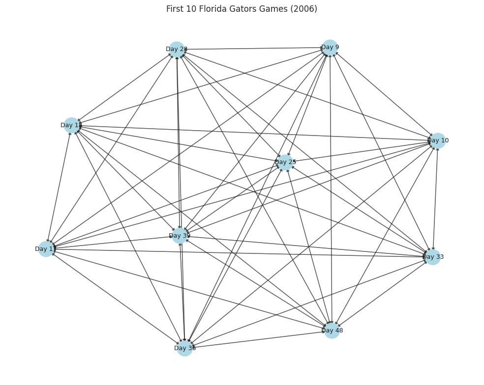
    


    
    Edge types in subgraph:
    Counter({np.int32(7): 44, np.int32(6): 19, np.int32(4): 19, np.int32(5): 8})


```python
# Check that the indexes in both node files match
same_indexes = (nodes_asc["Index"].values == nodes_des["Index"].values).all()
print(f"Nodes have identical indexes: {same_indexes}")

# Check a few random edges against both node files
random_edges = edges.sample(5)
print("\nRandom edges sample:")
print(random_edges)

# Verify these edges in both node files
for i, edge in random_edges.iterrows():
    source_asc = nodes_asc[nodes_asc["Index"] == edge["SourceIndex"]]
    source_des = nodes_des[nodes_des["Index"] == edge["SourceIndex"]]
    target_asc = nodes_asc[nodes_asc["Index"] == edge["TargetIndex"]]
    target_des = nodes_des[nodes_des["Index"] == edge["TargetIndex"]]

    print(f"\nSource Node {edge['SourceIndex']}:")
    print(f"- ASC: {source_asc['Le_TeamName'].values[0]} vs {source_asc['Ri_TeamName'].values[0]}")
    print(f"- DES: {source_des['Le_TeamName'].values[0]} vs {source_des['Ri_TeamName'].values[0]}")

    print(f"Target Node {edge['TargetIndex']}:")
    print(f"- ASC: {target_asc['Le_TeamName'].values[0]} vs {target_asc['Ri_TeamName'].values[0]}")
    print(f"- DES: {target_des['Le_TeamName'].values[0]} vs {target_des['Ri_TeamName'].values[0]}")
```

    Nodes have identical indexes: True
    
    Random edges sample:
               SourceIndex  SourceSeason  SourceNCAATourney  TargetIndex  TargetSeason  TargetNCAATourney  Type  Direction  Delta
    96669924        105251          2016                  0       103593          2016                  0     5         -1     19
    154095825       171262          2023                  0       172415          2023                  0     7          1     13
    147974405       164311          2022                  0       159564          2022                  0     4         -1     67
    28993008         33423          2009                  0        29611          2009                  0     6         -1     88
    110535149       119889          2018                  0       120478          2018                  0     7          1      6
    
    Source Node 105251:
    - ASC: Bucknell vs Holy Cross
    - DES: Holy Cross vs Bucknell
    Target Node 103593:
    - ASC: Boston Univ vs Loyola MD
    - DES: Loyola MD vs Boston Univ
    
    Source Node 171262:
    - ASC: DePaul vs Maryland
    - DES: Maryland vs DePaul
    Target Node 172415:
    - ASC: PFW vs St Thomas MN
    - DES: St Thomas MN vs PFW
    
    Source Node 164311:
    - ASC: Appalachian St vs Louisiana
    - DES: Louisiana vs Appalachian St
    Target Node 159564:
    - ASC: Duke vs UNC Wilmington
    - DES: UNC Wilmington vs Duke
    
    Source Node 33423:
    - ASC: Illinois vs Penn St
    - DES: Penn St vs Illinois
    Target Node 29611:
    - ASC: Brown vs Northwestern
    - DES: Northwestern vs Brown
    
    Source Node 119889:
    - ASC: Hofstra vs Stony Brook
    - DES: Stony Brook vs Hofstra
    Target Node 120478:
    - ASC: Central Conn vs Penn St
    - DES: Penn St vs Central Conn


```python
# Distribution of game margins
plt.figure(figsize=(10, 6))
sns.histplot(nodes_asc["Le_Margin"], bins=30, kde=True)
plt.title("Distribution of Game Margins")
plt.axvline(x=0, color='red', linestyle='--')
plt.grid(True, alpha=0.3)
plt.show()

# Distribution of margins by NCAA Tournament status
plt.figure(figsize=(10, 6))
sns.boxplot(x="NCAATourney", y="Le_Margin", data=nodes_asc)
plt.title("Game Margins by NCAA Tournament Status")
plt.grid(True, alpha=0.3)
plt.show()

# Calculate stats for NCAA Tournament games for 2021-2024 (test set)
test_games = nodes_asc[(nodes_asc["Season"].between(2021, 2024)) & (nodes_asc["NCAATourney"] == 1)]
print(f"Number of NCAA Tournament games (2021-2024): {len(test_games)}")
print(f"Mean margin in test games: {test_games['Le_Margin'].mean():.2f}")
print(f"Std dev of margin in test games: {test_games['Le_Margin'].std():.2f}")
```


    
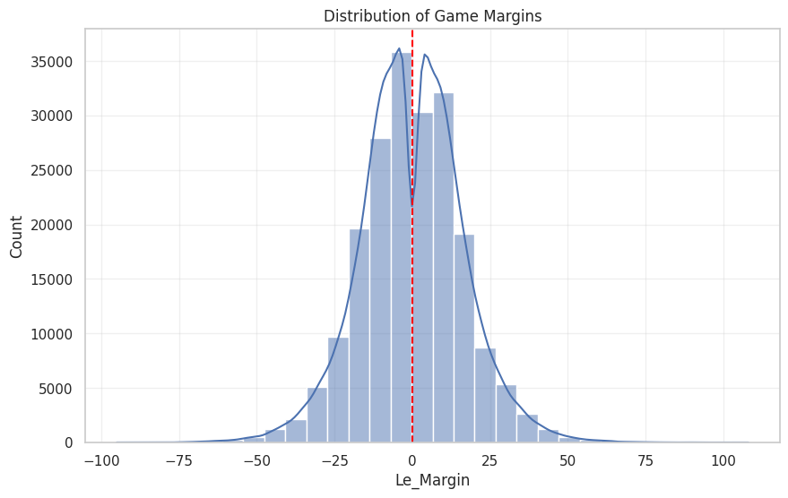
    


    
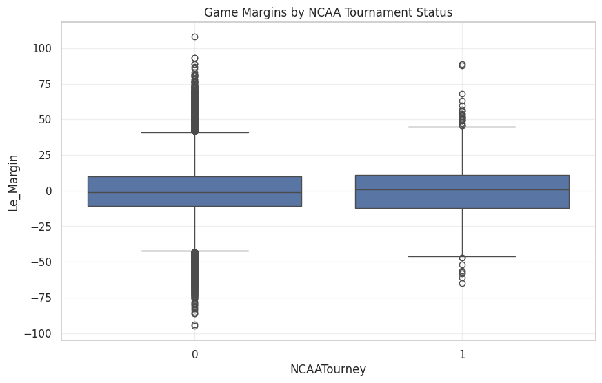
    


    Number of NCAA Tournament games (2021-2024): 531
    Mean margin in test games: 0.24
    Std dev of margin in test games: 18.00


```python
# Create a Florida subgraph with Direction * Delta edge labels
def create_florida_subgraph(season=2006, max_games=10):
    florida_season = florida_games[florida_games["Season"] == season].iloc[:max_games]
    florida_indexes = florida_season["Index"].tolist()

    # Get relevant edges (only between these games)
    subgraph_edges = edges[
        (edges["SourceIndex"].isin(florida_indexes)) &
        (edges["TargetIndex"].isin(florida_indexes))
    ]

    # Create a directed graph
    G = nx.DiGraph()

    # Add nodes (games)
    for idx, row in florida_season.iterrows():
        G.add_node(row["Index"],
                   label=f"{row['Le_TeamName']} vs {row['Ri_TeamName']}",
                   daynum=row["DayNum"],
                   tourney=row["NCAATourney"])

    # Add edges with Direction * Delta as an attribute
    for idx, row in subgraph_edges.iterrows():
        dir_delta = row["Direction"] * row["Delta"]
        G.add_edge(row["SourceIndex"], row["TargetIndex"],
                   type=row["Type"], dir_delta=dir_delta)

    return G, florida_season

G, florida_data = create_florida_subgraph(season=2006, max_games=10)

# Visualize the subgraph
plt.figure(figsize=(10, 8))
pos = nx.spring_layout(G, seed=42)

# Color nodes by type
node_colors = ["lightblue" if G.nodes[n]["tourney"] == 0 else "salmon" for n in G.nodes]

# Draw the network
nx.draw_networkx_nodes(G, pos, node_size=500, node_color=node_colors)
nx.draw_networkx_edges(G, pos, width=1, alpha=0.5)

# Add labels - just show DayNum for simplicity
labels = {n: f"Day {G.nodes[n]['daynum']}" for n in G.nodes}
nx.draw_networkx_labels(G, pos, labels=labels, font_size=9)

# Add edge labels (Direction * Delta)
edge_labels = {(u, v): f"{G.edges[u, v]['dir_delta']}" for u, v in G.edges}
# Only show a subset of labels to avoid overcrowding
sample_edges = list(G.edges())[:20]  # Just show first 20 edge labels
sample_edge_labels = {e: edge_labels[e] for e in sample_edges}
nx.draw_networkx_edge_labels(G, pos, edge_labels=sample_edge_labels, font_size=7)

plt.title("First 10 Florida Gators Games (2006) with Direction*Delta Labels")
plt.axis('off')
plt.tight_layout()
plt.show()

# Count edge types and their direction*delta values in this subgraph
edge_types = {}
for u, v, data in G.edges(data=True):
    edge_type = data["type"]
    dir_delta = data["dir_delta"]
    if edge_type not in edge_types:
        edge_types[edge_type] = []
    edge_types[edge_type].append(dir_delta)

print("\nEdge types with Direction*Delta range:")
for t, values in edge_types.items():
    print(f"Type {t}: {len(values)} edges, Dir*Delta range: [{min(values)} to {max(values)}]")
```


    
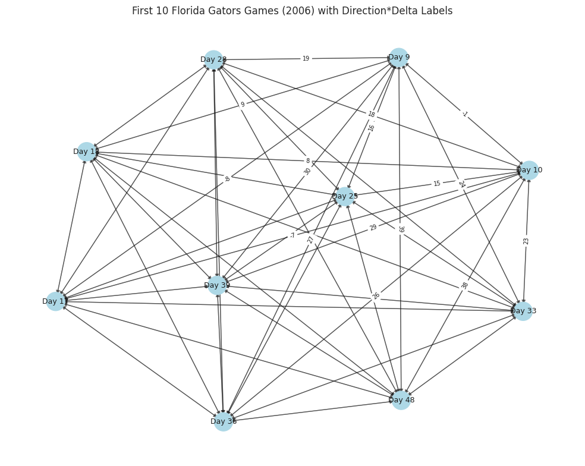
    


    
    Edge types with Direction*Delta range:
    Type 6: 19 edges, Dir*Delta range: [-38 to 30]
    Type 7: 44 edges, Dir*Delta range: [-39 to 39]
    Type 4: 19 edges, Dir*Delta range: [-30 to 38]
    Type 5: 8 edges, Dir*Delta range: [-29 to 29]


```python
print(nodes_asc.sort_values("Le_Margin").iloc[[0]])
```

             Index                 Key  Season       Date  Le_TeamID  Ri_TeamID  Le_TeamName Ri_TeamName  Le_Margin  SeasonsAgo  Men  NCAATourney  DayNum  NumOT  Le_Loc  Le_Score  Le_FGM  Le_FGA  Le_FGM3  Le_FGA3  Le_FTM  Le_FTA  Le_OR  Le_DR  Le_Ast  Le_TO  Le_Stl  Le_Blk  Le_PF  Ri_Score  Ri_FGM  Ri_FGA  Ri_FGM3  Ri_FGA3  Ri_FTM  Ri_FTA  Ri_OR  Ri_DR  Ri_Ast  Ri_TO  Ri_Stl  Ri_Blk  Ri_PF
    159178  159178  2022_008_3309_3400    2022 2021-11-09       3309       3400  New Orleans       Texas        -95           3    0            0       8      0      -1        36      12      49        5       21       7      10      6     13       8     37       4       1     33       131      47      77       13       23      24      43     19     28      30     12      17       3     17


[Texas Women's 2021-22 schedule and results](https://texaslonghorns.com/sports/womens-basketball/schedule/2021-22)

vs. New Orleans 131-36


```python
print(nodes_asc[nodes_asc["NCAATourney"] == 1].sort_values("Le_Margin").iloc[[0]])
```

           Index                 Key  Season       Date  Le_TeamID  Ri_TeamID Le_TeamName Ri_TeamName  Le_Margin  SeasonsAgo  Men  NCAATourney  DayNum  NumOT  Le_Loc  Le_Score  Le_FGM  Le_FGA  Le_FGM3  Le_FGA3  Le_FTM  Le_FTA  Le_OR  Le_DR  Le_Ast  Le_TO  Le_Stl  Le_Blk  Le_PF  Ri_Score  Ri_FGM  Ri_FGA  Ri_FGM3  Ri_FGA3  Ri_FTM  Ri_FTA  Ri_OR  Ri_DR  Ri_Ast  Ri_TO  Ri_Stl  Ri_Blk  Ri_PF
    55338  55338  2011_138_3391_3397    2011 2011-03-19       3391       3397     Stetson   Tennessee        -65          14    0            1     138      0      -1        34      12      66        3       24       7       9     10     21       3     13       3       1     18        99      39      70        8       20      13      24     17     46      19      7       7       9     10


  [2011 Women's NCAA Tourney](https://en.wikipedia.org/wiki/2011_NCAA_Division_I_women%27s_basketball_tournament#Dayton_Region)

1 Tennessee vs 16 Stetson: 99-34


```python
plt.figure(figsize=(12, 8))
ax = sns.boxplot(x="NCAATourney", y="Le_Margin", data=nodes_asc)
plt.title("Game Margins by NCAA Tournament Status", fontsize=16)
plt.grid(True, alpha=0.3)

# Add annotations for key components - focusing on the first box (index 0)
# Hardcoding positions for annotations instead of trying to extract them from artists

# Median line annotation
plt.annotate('Median\n(50th percentile)',
             xy=(0, 0),  # Approximate median position
             xytext=(-0.4, 10),
             arrowprops=dict(arrowstyle='->'),
             fontsize=11)

# 75th percentile (top of box)
plt.annotate('75th percentile',
             xy=(0, 10),  # Approximate top of box
             xytext=(-0.4, 20),
             arrowprops=dict(arrowstyle='->'),
             fontsize=11)

# 25th percentile (bottom of box)
plt.annotate('25th percentile',
             xy=(0, -10),  # Approximate bottom of box
             xytext=(-0.4, -20),
             arrowprops=dict(arrowstyle='->'),
             fontsize=11)

# Upper whisker
plt.annotate('Upper whisker (~99.3 percentile)\n1.5 × IQR from 75th',
             xy=(0, 40),  # Approximate whisker position
             xytext=(-0.5, 55),
             arrowprops=dict(arrowstyle='->'),
             fontsize=11)

# Lower whisker
plt.annotate('Lower whisker (~0.7 percentile)\n1.5 × IQR from 25th',
             xy=(0, -40),  # Approximate whisker position
             xytext=(-0.5, -55),
             arrowprops=dict(arrowstyle='->'),
             fontsize=11)

# Outliers
plt.annotate('Outliers (~0.7% of data)\nBeyond 1.5 × IQR from quartiles',
             xy=(0, 85),
             xytext=(0.25, 95),
             arrowprops=dict(arrowstyle='->'),
             fontsize=11)

# Add legend for box meaning
plt.figtext(0.15, 0.01, "Blue box represents the Interquartile Range (IQR),\nthe middle 50% of the data",
            ha="left", fontsize=12, bbox={"facecolor":"lightblue", "alpha":0.5, "pad":5})

# Better x-axis labels
plt.xticks([0, 1], ['Non-Tournament Teams', 'Tournament Teams'])
plt.xlabel("NCAA Tournament Status", fontsize=12)
plt.ylabel("Game Margin", fontsize=12)

plt.tight_layout()
plt.show()
```


    
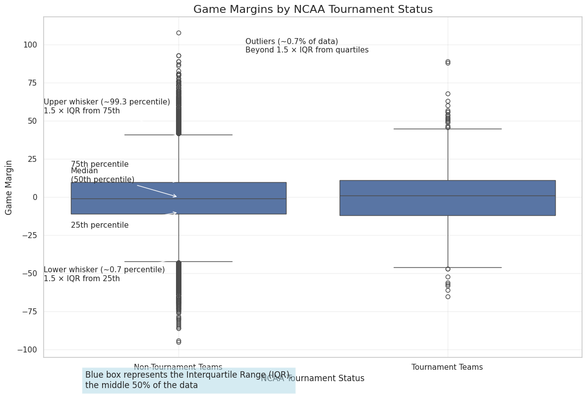
    


```python
# Function to create visualization for a specific edge type
def visualize_edge_type(edges_df, edge_type, source_node=17126):
    # Filter edges by source node and edge type
    filtered_edges = edges_df[(edges_df['SourceIndex'] == source_node) &
                              (edges_df['Type'] == edge_type)]

    if filtered_edges.empty:
        print(f"No edges of type {edge_type} from node {source_node}")
        return

    # Create graph
    G = nx.DiGraph()

    # Add source node
    source_row = nodes_asc[nodes_asc['Index'] == source_node].iloc[0]
    G.add_node(source_node,
               label=f"{source_row['Le_TeamName']} vs {source_row['Ri_TeamName']}\n{source_row['Le_Score']}-{source_row['Ri_Score']}",
               pos_x=0,
               pos_y=0)

    # Add target nodes and edges
    for idx, edge in filtered_edges.iterrows():
        target_node = edge['TargetIndex']
        if target_node == source_node:
            continue

        target_row = nodes_asc[nodes_asc['Index'] == target_node].iloc[0]

        # Position based on Direction * Delta
        pos_x = edge['Direction'] * edge['Delta']
        pos_y = (idx % 5 - 2) * 0.8 + np.random.uniform(-0.3, 0.3)

        G.add_node(target_node,
                   label=f"{target_row['Le_TeamName']} vs {target_row['Ri_TeamName']}\n{target_row['Le_Score']}-{target_row['Ri_Score']}",
                   pos_x=pos_x,
                   pos_y=pos_y)

        G.add_edge(source_node, target_node,
                   weight=edge['Direction'] * edge['Delta'],
                   delta=edge['Delta'],
                   direction=edge['Direction'])

    plt.figure(figsize=(20, 14))

    # Create position dictionary
    pos = {node: (G.nodes[node]['pos_x'], G.nodes[node]['pos_y']) for node in G.nodes()}

    # Draw nodes
    nx.draw_networkx_nodes(G, pos, node_size=800, node_color='lightblue')

    # Draw edges with color based on direction
    edge_colors = ['red' if G.edges[e]['direction'] < 0 else 'green' for e in G.edges()]
    nx.draw_networkx_edges(G, pos, arrowsize=20, width=2, edge_color=edge_colors)

    # Draw edge labels
    edge_labels = {(u, v): f"{G.edges[u, v]['direction'] * G.edges[u, v]['delta']}" for u, v in G.edges()}
    nx.draw_networkx_edge_labels(G, pos, edge_labels=edge_labels, font_size=10)

    # Draw node labels
    node_labels = {n: G.nodes[n]['label'] for n in G.nodes()}
    nx.draw_networkx_labels(G, pos, labels=node_labels, font_size=10, font_weight='bold')

    plt.title(f"Connections from Game {source_node} (Edge Type {edge_type})")
    plt.axhline(y=0, color='gray', linestyle='--', alpha=0.3)
    plt.axvline(x=0, color='gray', linestyle='--', alpha=0.3)
    plt.xlim(-max([abs(v) for v in nx.get_node_attributes(G, 'pos_x').values()]) * 1.1,
             max([abs(v) for v in nx.get_node_attributes(G, 'pos_x').values()]) * 1.1)
    plt.axis('off')
    plt.tight_layout()
    plt.show()
```


```python
visualize_edge_type(edges, 0)
```


    
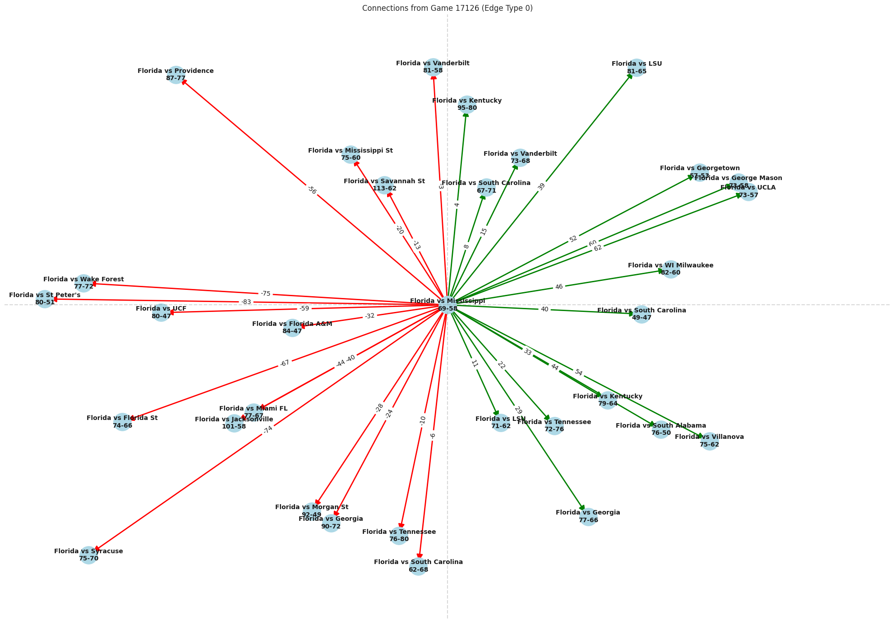
    


```python
visualize_edge_type(edges, 1)
```


    
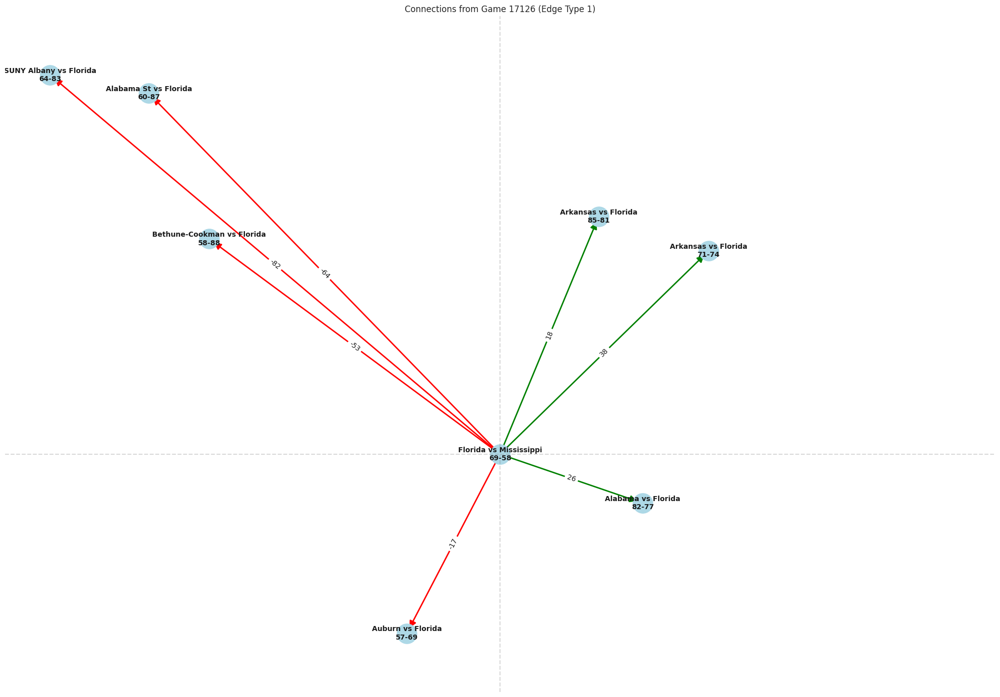
    


```python
visualize_edge_type(edges, 2)
```


    
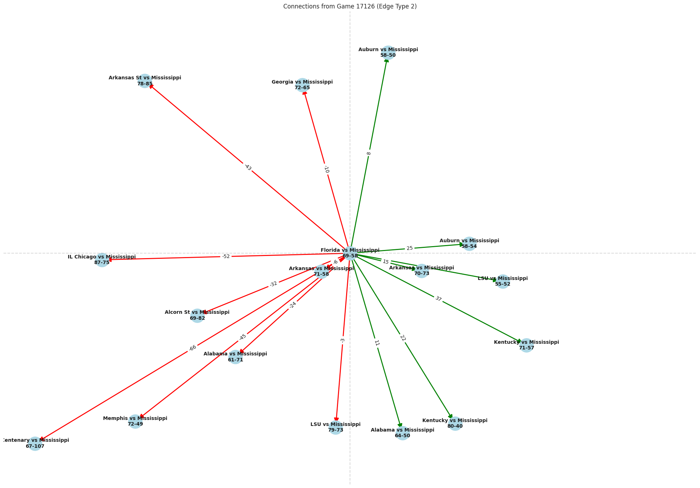
    


```python
visualize_edge_type(edges, 3)
```


    
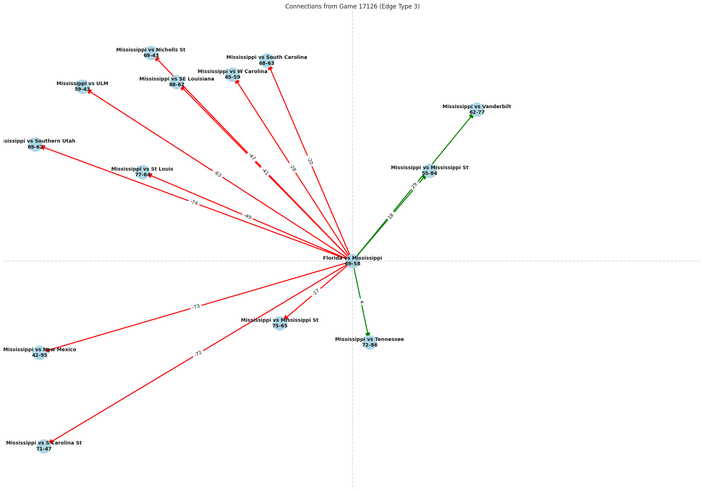
    


```python
visualize_edge_type(edges, 4)
```


    Output hidden; open in https://colab.research.google.com to view.


```python
visualize_edge_type(edges, 5)
```


    Output hidden; open in https://colab.research.google.com to view.


```python
visualize_edge_type(edges, 6)
```


    
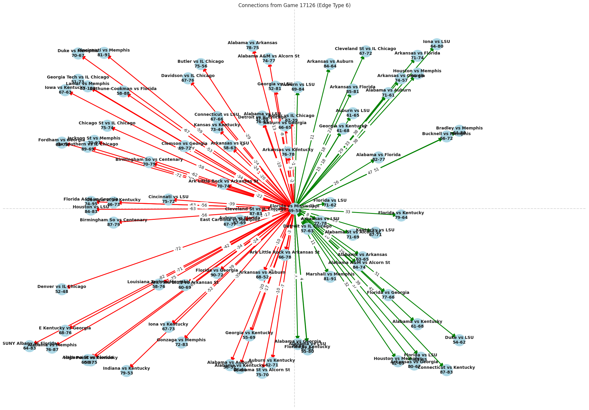
    


```python
visualize_edge_type(edges, 7)
```


    
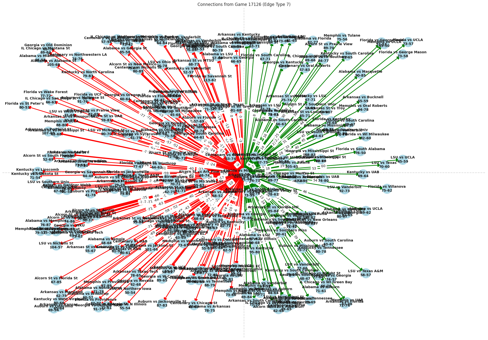
    


```python

```
